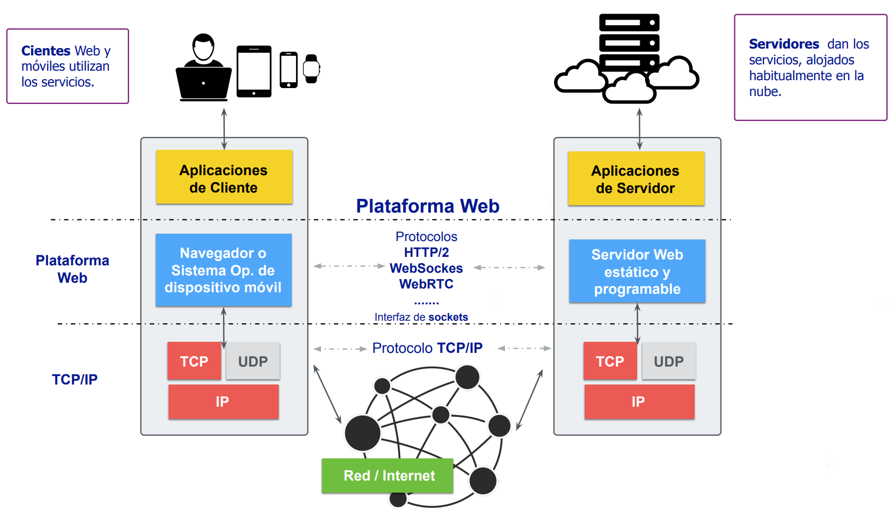

# Cliente/Servidor

Como se ha comentado en la sección anterior el modelo **cliente-servidor** es la base de las aplicaciones distribuidas en Internet. En este esquema, el cliente es el dispositivo o software que realiza peticiones, mientras que el servidor es el que procesa esas solicitudes y devuelve una respuesta. Un ejemplo claro es cuando accedemos a una página web: nuestro navegador (cliente) solicita una página a un servidor web, que procesa la petición y envía el contenido en forma de HTML, CSS y JavaScript. Este modelo permite la distribución de tareas, optimizando recursos y facilitando la escalabilidad.

La interacción entre un cliente y un servidor se apoya en el **modelo OSI** (Open Systems Interconnection) para garantizar que los datos se transmitan correctamente a través de la red. Cada solicitud que hace un cliente sigue las capas del modelo OSI, desde la **Capa de Aplicación**, donde protocolos como HTTP, hasta la **Capa de Transporte**, donde los protocolos como TCP o UDP determinan como se van a enviar los paquetes de datos. Luego, la información atraviesa las Capas de Red y Enlace de Datos, que determinan la mejor ruta y garantizan la entrega física de los paquetes. En el servidor, el proceso se invierte: los datos ascienden por las capas de OSI hasta llegar a la aplicación que generará la respuesta. 

    

 

A lo largo de los años, el cliente-servidor ha evolucionado con tecnologías como APIs REST, WebSockets y microservicios, adaptándose a las necesidades de aplicaciones modernas.

## Cliente

En el contexto de Internet, se denomina **cliente** tanto a los dispositivos que acceden a la red como a los programas que interactúan con los servicios en línea.  

Los **dispositivos clientes** incluyen **PCs, portátiles, tabletas, teléfonos y relojes inteligentes**, entre otros. Estos equipos se conectan a Internet para solicitar y consumir información o servicios.  

Además, los clientes también pueden ser **programas específicos** diseñados para interactuar con servidores. El **navegador web** es el cliente más utilizado para acceder a la Web, con ejemplos populares como **Chrome, Firefox, Edge, Opera y Safari**. Estos navegadores interpretan contenido desarrollado en **HTML, CSS y JavaScript** para mostrar páginas interactivas a los usuarios.

En la actualidad, las aplicaciones móviles han ganado protagonismo como clientes principales. Existen dos tipos principales de aplicaciones en dispositivos móviles:

- **Aplicaciones nativas**, desarrolladas específicamente para cada sistema operativo, como **Android** (programado en **Java/Kotlin**) e **iOS** (usando **Swift**).  
- **Aplicaciones basadas en tecnologías web**, como las **Progressive Web Apps (PWAs)** o las creadas con **React Native**, que reutilizan código web y pueden ejecutarse en múltiples plataformas, desde ordenadores a móviles.  

## Servidor  

El término **servidor** se refiere tanto a la máquina que proporciona servicios en Internet como al software que gestiona estas solicitudes.  

Un **servidor físico o virtual** es un equipo configurado para responder a las peticiones de los clientes. Puede ser una máquina dedicada o una **instancia en la nube**, y cuenta con una dirección IP o dominio que permite su localización en la red.  

Además, un **servidor** es también el software encargado de gestionar las peticiones y responder a los clientes. Estos programas se ejecutan en la máquina servidora y utilizan **puertos específicos** para la comunicación, como el **puerto 80** (desginado por defecto para el protocolo HTTP) para servidores web.  