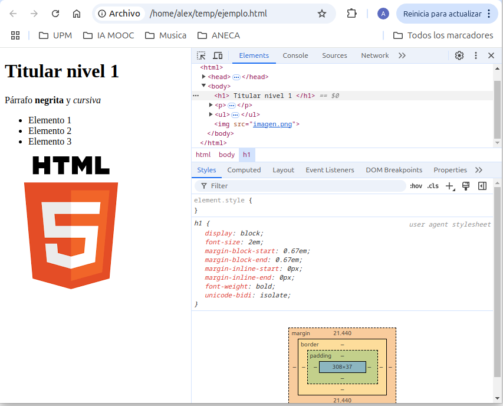
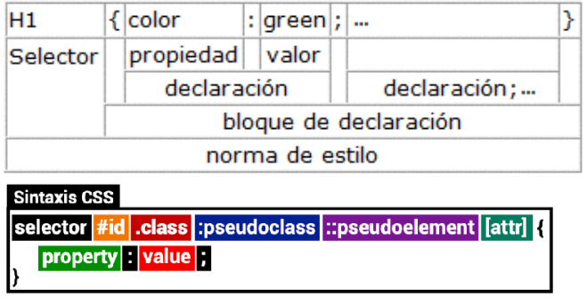
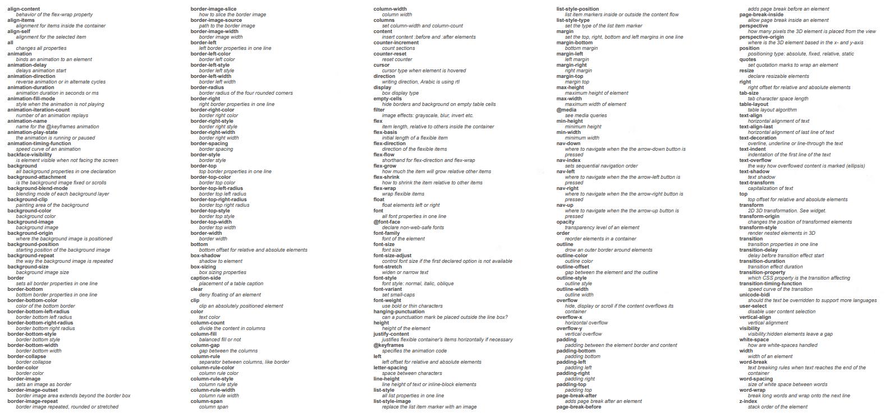
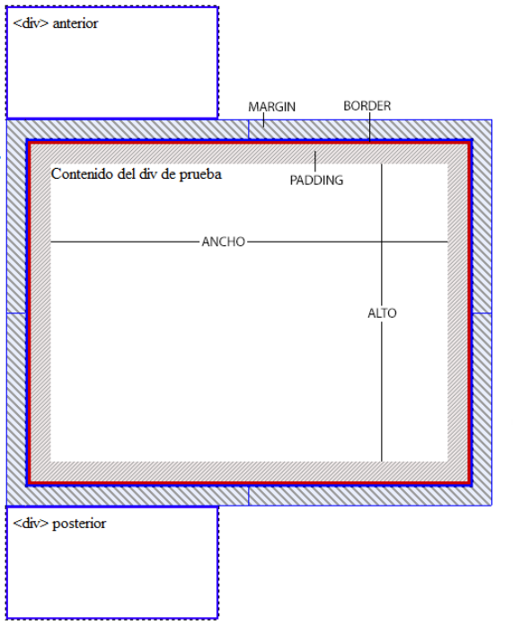
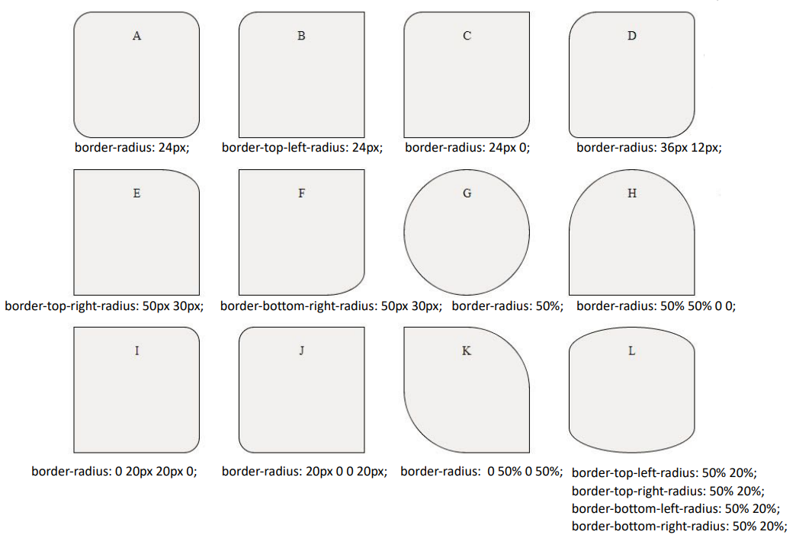

# CSS

CSS (Cascading Style Sheets) es un lenguaje de diseño gráfico para definir el aspecto de las páginas web. CSS se utiliza para controlar el diseño de múltiples páginas web a la vez. CSS se utiliza para definir estilos para las páginas web, incluyendo el diseño y las variaciones en la pantalla para diferentes dispositivos y tamaños de pantalla.

## Formas de añadir estilo a una página web

Para dotar de estilos a una página web se pueden utilizar tres métodos:

- **Estilos en línea**: Se añaden directamente en la etiqueta HTML.

```html
<p style="color: yellow; font-style: italic;">un párrafo</p>
```

- **Estilos internos**: Se añaden en la cabecera de la página HTML.

```html
<head>
 <style type="text/css">
 b { font-size: 12pt; color: green; }
 /* Cabeceras */
 h1, h2 { margin-left: 15pt; color: red; }
 </style>
</head>
```

- **Estilos externos**: Se añaden en un archivo CSS externo y se referencias desde el HTML.

```html
<link rel="stylesheet" type="text/css" href="estilo.css">
```

La forma recomendable de añadir estilos a una página web es mediante un archivo CSS externo ya que permite reutilizar los estilos en todas las páginas de un sitio web y se facilita la tarea de mantenimiento.

Por otro lado, cada etiqueta HTML tiene unos valores por defecto de CSS en cada navegador. Por ejemplo, el color de un enlace es azul y subrayado. Estos valores por defecto se pueden modificar con CSS para adaptarlos a lo que se desee.

<div class="img-center">
    
</div>

<br>

Por tanto, una cuestión que existe es ¿si en un mismo elemento coincide varios estilos definidos de distintas formas, cuál prevalece? La respuesta es que el orden de prioridad de aplicación de estilos.

### Orden de aplicación de estilos

Los estilos se aplica en el siguiente orden de prioridad:

1. **Estilos en línea**: Tienen la máxima prioridad.
2. **Estilos internos**: Tienen prioridad sobre los estilos externos.
3. **Estilos externos**: Tienen menor prioridad que los estilos internos.
4. **Estilos por defecto del navegador**: Tienen la mínima prioridad.

Esto quiere decir que si por ejemplo, un elemento tiene definido en línea que su background-color es rojo, en los estilos internos se define que el background-color es azul y en los estilos externos se define que el background-color es verde, **el color de fondo del elemento será rojo**.

Por otro lado, a nivel de propiedades CSS existe un orden de prioridad. Si se define una propiedad en un selector más específico, prevalecerá sobre la propiedad definida en un selector menos específico. Por ejemplo, si se define un color de texto para todos los párrafos y un color de texto para un párrafo con una clase concreta, prevalecerá el color de texto definido para el párrafo con la clase concreta. Esto se conoce como **reglas de herencia**. Se tratan de reglas algo complejas y que estan un poco al margen de este curso, pero es importante tenerlas en cuenta, ya que en muchas ocasiones se pueden dar situaciones en las que no se obtiene el resultado esperado y es debido a ellas.

Como comentario final sobre la prioridad, se puede definir un estilo `!important` que prevalecerá sobre cualquier otro estilo. Por ejemplo se puede poner:

```css
p {
    color: red !important;
}
```

Y en este caso, el color de texto de todos los párrafos será rojo, independientemente de los estilos definidos en otros selectores previamente y saltantose reglas de herencia y prioridad. No obstante, **se considera una mala práctica su uso, ya que puede llevar a problemas de mantenimiento y de legibilidad del código**

## Reglas de estilo

Las reglas de estilo se definen mediante un selector y un bloque de declaraciones. Un selector **es un identificador que se utiliza para aplicar un estilo a un elemento** HTML en concreto. Las **declaraciones son las propiedades CSS que se aplican al elemento HTML**.

La estructura de un estilo CSS tiene la siguiente forma:

<div class="img-center">
    
</div>

<br>

Por ejemplo, un estilo CSS que defina que todos los párrafos de una página web tengan un color de texto rojo y un tamaño de fuente de 12 puntos se puede definir de la siguiente forma:

```css
p { /* Selector */
    color: red; /* Propiedad */
    font-size: 12px; /* Propiedad */
}
```
### Selectores

Existen varias formas de seleccionar elementos HTML para aplicarles un estilo CSS. Los selectores más comunes son:

**Selectores de tipo**: Seleccionan todos los elementos de un tipo concreto. Por ejemplo, el selector `p` selecciona todos los elementos de tipo párrafo.

```css
p {
    color: red;
}
```

Se pueden seleccionar varios elementos a la vez separándolos por comas. Por ejemplo, el selector `h1, h2` selecciona todos los elementos de tipo `h1` y `h2`. Esto aplicará el estilo tanto a los elementos `h1` como a los elementos `h2`.

```css
h1, h2 {
    color: red;
}
```

Incluso se pueden seleccionar todos los elementos de la página web con el selector `*`.

```css
* {
    color: red;
}
```


Se puede también definir el estilo de una etiqueta anidada dentro de otra. Por ejemplo, el selector `div p` selecciona todos los elementos de tipo `p` que están anidados dentro de un elemento de tipo `div`.

```css
div p {
    color: red;
}
```

**Selectores de clase**: Seleccionan todos los elementos que tienen una clase HTML concreta (programada previamente en el fichero HTML). Por ejemplo, el selector `.titulo` selecciona todos los elementos que tienen la clase `titulo` dentro del documento HTML y aplica el estilo definido.

```css
.clase {
    color: red;
}
```

**Selectores de identificador**: Seleccionan un elemento con un identificador HTML concreto (programada previamente en el fichero HTML). Por ejemplo, el selector `#titulo` selecciona el elemento con el identificador `titulo` dentro del documento HTML y aplica el estilo definido.

```css
#titulo {
    color: red;
}
```

**Selectores de atributo**: Seleccionan todos los elementos que tienen un atributo HTML concreto. Por ejemplo, el selector `a[href]` selecciona todos los elementos de tipo `a` que tienen un atributo `href`.

```css
a[href] {
    color: red;
}
```

**Selectores de pseudoclases**: Seleccionan un elemento en un estado concreto. Por ejemplo, el selector `a:hover` selecciona un elemento de tipo `a` cuando el ratón está encima de él. En este caso, el color del enlace se cambiará a rojo cuando el ratón esté encima del enlace.

```css
a:hover {
    color: red;
}
```

Hay varios selectores de pseudoclases que se pueden utilizar para seleccionar elementos en diferentes estados. Algunos de los más comunes son: `:hover`, `:active`, `:focus`, `:first-child`, `:last-child`, `:nth-child`, `:nth-of-type`, `:not`, `:empty`, `:checked`, `:disabled`, `:enabled`, `:required`, `:optional`, etc.

Incluso se pueden combinar selectores para seleccionar elementos en diferentes estados. Por ejemplo, el selector `h1.grande` selecciona todos los elementos de tipo `h1` que tienen además la clase `grande`.

```css
h1.grande {
    font-size: 24px;
}
```

Una vez definido como se seleccionan los elementos, se pueden definir las propiedades CSS que se aplicarán a los elementos seleccionados.


### Propiedades

En CSS existen muchas propiedades que se pueden aplicar a los elementos HTML. En la imagen siguiente se muestran muchas de ellas:

<div class="img-center">
    
</div>

<br>

No obstante, en este curso se verán las propiedades más comunes y que se utilizan en la mayoría de los casos.

#### Modelo de cajas

Todos los elementos HTML se representan como cajas rectangulares. El modelo de cajas de CSS define cómo se representan los elementos HTML en una página web. Este modelo de cajas es el que permite definir el tamaño, la posición y el espacio entre los elementos HTML. El modelo de cajas de CSS se compone de cuatro partes: 

- **Contenido**: Es el contenido del elemento HTML, como el texto o las imágenes.
- **Padding**: Es el espacio entre el contenido y el borde del elemento.
- **Borde**: Es el borde del elemento.
- **Margen**: Es el espacio entre el borde del elemento y los elementos adyacentes.


<div class="img-center">
    
</div>

<br>

**La propiedad `margin`** define el margen de un elemento HTML. El margen es el espacio entre el borde del elemento y los elementos adyacentes. Podemos definir el margen de un elemento de las siguientes formas:

```css
margin: 10px; /* Todos los márgenes alrededor de la caja son de 10px */
margin: 10px 20px; /* El margen superior e inferior es de 10px y el margen izquierdo y derecho es de 20px */
margin: 10px 20px 30px; /* El margen superior es de 10px, el margen izquierdo y derecho es de 20px y el margen inferior es de 30px */
margin: 10px 20px 30px 40px; /* El margen superior es de 10px, el margen derecho es de 20px, el margen inferior es de 30px y el margen izquierdo es de 40px */
```

Se pueden definir también márgenes específicos para cada lado de la caja. Por ejemplo, el margen superior se puede definir con la propiedad `margin-top`, el margen derecho con la propiedad `margin-right`, el margen inferior con la propiedad `margin-bottom` y el margen izquierdo con la propiedad `margin-left`.

```css
margin-top: 10px;
margin-right: 20px;
margin-bottom: 30px;
margin-left: 40px;
```

**La propiedad `padding`** define el relleno de un elemento HTML. El relleno es el espacio entre el contenido del elemento y el borde del elemento. La forma de definir el padding es igual que en el caso de margin pero con la propiedad `padding`.

**La propiedad `border`** define el borde de un elemento HTML. El borde es la línea que rodea el contenido y el relleno de un elemento. La forma de definir el borde es ligeramente diferente a la de margin y padding. Se puede definir el borde de un elemento de la siguiente forma:

```css
border: 1px solid black; /* El borde es de 1px de ancho, sólido y de color negro *\
```

El primer elemento de la propiedad define el grosor del borde, el segundo el tipo de borde que es (solid, dotted, dashed, double, etc) y último define el color del borde. Al igual que en el caso de **margin y padding se pueden definir bordes para una arista en concreto**. A parte, los bordes pueden tener otras propiedades como `border-radius` que permite redondear los bordes e incluso cambiar la forma del elemento como se puede ver en la siguiente imagen: 

<div class="img-center">
    
</div>

<br>

En cuanto **al contenido no existe una propiedad contenido como tal**, pero existen una serie de **propiedades que permite dimensionar el tamaño de ese espacio** como:

- `width`: ancho de la caja.
- `height`: altura de la caja.
- `min-width` y `max-width`: fijan el ancho mínimo y máximo de la caja.
- `min-height` y `max-height`: fijan la altura mínima y máxima de la caja.

Al igual que ocurre con padding, border y margin tenemos que especificar en que unidades queremos que se mida el tamaño de la caja como se verá a continuación.


#### Unidades

Las unidades de medida en CSS se utilizan para definir el tamaño de los elementos HTML. Las unidades de medida más comunes en CSS son:

- **Valores absolutos** como 2px (2 pixels), 2mm (2 milímetros), 2cm (2 centímetros), 2in (2 pulgadas), etc.
- **Valores relativos al font** como 2em (2 veces el tamaño de la fuente actual), 2rem (2 veces el tamaño de la fuente del elemento raíz), etc.
- **Valores relativos al viewport** como 2vw (2% del ancho de la ventana gráfica), 2vh (2% de la altura de la ventana gráfica), etc.
- **Valores relativos al padre** como 2% (2% del tamaño del elemento padre), 2vmin (2% del tamaño del viewport más pequeño), 2vmax (2% del tamaño del viewport más grande), etc.

En cuanto a los colores, se pueden definir de varias formas:

- **Por nombre**: Se pueden definir los colores por su nombre. Por ejemplo, el color rojo se puede definir con el nombre `red`.
- **Por valor hexadecimal**: Se pueden definir los colores por su valor hexadecimal. Por ejemplo, el color rojo se puede definir con el valor `#ff0000`.
- **Por valor RGB**: Se pueden definir los colores por su valor RGB. Por ejemplo, el color rojo se puede definir con el valor `rgb(255, 0, 0)`.


#### Posicionamiento

Inmediatamente despúes al tamaño de las cajas, las siguientes propiedades más importantes son las de posicionamiento. Para ello se usa la propiedad `position` que puede tener los siguientes valores:

- **static**: Es la posición por defecto de los elementos HTML. Los elementos se colocan en el orden en el que aparecen en el código HTML.
- **relative**: Los elementos se colocan en relación a su posición original. Se puede desplazar el elemento de su posición original utilizando las propiedades `top`, `right`, `bottom` y `left`.
- **absolut**: Los elementos se colocan en relación al primer elemento padre que tiene una posición relativa. Se puede desplazar el elemento de su posición original utilizando las propiedades `top`, `right`, `bottom` y `left`.
- **fixed**: Los elementos se colocan en relación a la ventana gráfica. Se puede desplazar el elemento de su posición original utilizando las propiedades `top`, `right`, `bottom` y `left`.
- **sticky**: Los elementos se colocan en relación a la ventana gráfica hasta que se desplazan fuera de la pantalla. En ese momento, el elemento se convierte en un elemento fijo.

Por otro lado, se puede definir la propiedad `display` que permite definir como se va a mostrar el elemento. Algunos de los valores que puede tener son:

- **block**: El elemento se muestra como un bloque con un salto de línea antes y después del elemento.
- **inline**: El elemento se muestra como una línea en la misma línea que el contenido anterior y posterior.
- **inline-block**: El elemento se muestra como una línea pero permite definir el ancho y el alto del elemento.
- **none**: El elemento no se muestra en la página web.
- **flex**: El elemento se muestra como un contenedor flexible que permite definir cómo se distribuyen los elementos hijos.
- **grid**: El elemento se muestra como un contenedor de cuadrícula que permite definir cómo se distribuyen los elementos hijos.

Estos dos últimos resultan de **especial interés ya que permiten definir la distribución de los elementos hijos de una forma más sencilla y eficiente que con los valores block e inline**. Son los más usados a la hora de ordenadr todos los elementos dentro de nuestra página web.

**Se recomienda encarecidamente** visitar las páginas [Flexbox](https://css-tricks.com/snippets/css/a-guide-to-flexbox/) y [Grid](https://css-tricks.com/snippets/css/complete-guide-grid/) para ver ejemplos de cómo se pueden utilizar estas propiedades para definir la distribución de los elementos hijos de una forma más sencilla y eficiente. Estas páginas **ilustran a la perfección como funcionan estas propiedades** y nos facilitarán mucho la tarea de distribución de los elementos en nuestra página web.

Por último, en cuanto a posicionamiento, existe la propiedad **z-index** que permite definir la posición de un elemento en el eje z. Por defecto, todos los elementos tienen un z-index de 0. Si se define un z-index mayor que 0, el elemento se colocará por encima de los elementos con un z-index de 0. Si se define un z-index menor que 0, el elemento se colocará por debajo de los elementos con un z-index de 0. Es decir, **esta propiedad permite superponer elementos unos sobre otros**.


#### Otros

Por último, existen otras propiedades que se pueden definir en los elementos HTML como:

<table>
    <thead>
        <tr>
            <th>Propiedad</th>
            <th>Descripción</th>
        </tr>
    </thead>
    <tbody>
        <tr>
            <td><code>background-color</code></td>
            <td>Define el color de fondo de un elemento.</td>
        </tr>
        <tr>
            <td><code>background-image</code></td>
            <td>Define la imagen de fondo de un elemento.</td>
        </tr>
        <tr>
            <td><code>background-repeat</code></td>
            <td>Define la repetición de la imagen de fondo de un elemento.</td>
        </tr>
        <tr>
            <td><code>color</code></td>
            <td>Define el color del texto de un elemento.</td>
        </tr>
        <tr>
            <td><code>font-family</code></td>
            <td>Define la fuente del texto de un elemento.</td>
        </tr>
        <tr>
            <td><code>font-size</code></td>
            <td>Define el tamaño de la fuente del texto de un elemento.</td>
        </tr>
        <tr>
            <td><code>font-style</code></td>
            <td>Define el estilo de la fuente del texto de un elemento.</td>
        </tr>
        <tr>
            <td><code>font-weight</code></td>
            <td>Define el grosor de la fuente del texto de un elemento.</td>
        </tr>
        <tr>
            <td><code>text-align</code></td>
            <td>Define la alineación del texto de un elemento.</td>
        </tr>
        <tr>
            <td><code>text-decoration</code></td>
            <td>Define la decoración del texto de un elemento.</td>
        </tr>
        <tr>
            <td><code>text-transform</code></td>
            <td>Define la transformación del texto de un elemento.</td>
        </tr>
        <tr>
            <td><code>text-shadow</code></td>
            <td>Define la sombra del texto de un elemento.</td>
        </tr>
        <tr>
            <td><code>box-shadow</code></td>
            <td>Define la sombra de la caja de un elemento.</td>
        </tr>
        <tr>
            <td><code>border-radius</code></td>
            <td>Define el radio de los bordes de un elemento.</td>
        </tr>
        <tr>
            <td><code>opacity</code></td>
            <td>Define la opacidad de un elemento.</td>
        </tr>
        <tr>
            <td><code>visibility</code></td>
            <td>Define la visibilidad de un elemento.</td>
        </tr>
        <tr>
            <td><code>overflow</code></td>
            <td>Define el comportamiento de un elemento cuando el contenido es más grande que el tamaño del elemento (añade la barra de desplazamiento).</td>
        </tr>
        <tr>
            <td><code>cursor</code></td>
            <td>Define el cursor del ratón cuando pasa por encima de un elemento.</td>
        </tr>
        <tr>
            <td><code>transition</code></td>
            <td>Define la transición de un elemento. (Permite crear efectos)</td>
        </tr>
        <tr>
            <td><code>animation</code></td>
            <td>Define la animación de un elemento. (Permite crear efectos)</td>
        </tr>
    </tbody>
</table>

<br>

---

Con estos estilos se pueden definir páginas web con un aspecto visual muy atractivo. No obstante, **es importante tener en cuenta que el diseño de una página web no solo se basa en el aspecto visual, sino también en la usabilidad y accesibilidad de la página web**. Por tanto, es importante tener en cuenta estos aspectos a la hora de diseñar una página web. Muchas veces lo que a nosotros nos parece intuitivo para otras personas no lo es, por lo que suele ser conveniente hacer pruebas con usuarios para ver si el diseño de la página web es adecuado. Por tanto, **Se recomienda experimentar con las propiedades CSS y ver cómo se pueden combinar para crear diseños atractivos y funcionales**.

Por otro lado, es importante comentar que ultimamente se usan librerías como SASS o SCSS que permiten definir estilos de una forma más sencilla y eficiente. Estas librerías permiten definir variables, funciones, anidamiento de estilos, etc. que facilitan la tarea de definir estilos en una página web. No obstante, **en este curso no se verán estas librerías** ya que se considera que es más importante aprender primero CSS y después aprender estas librerías.

