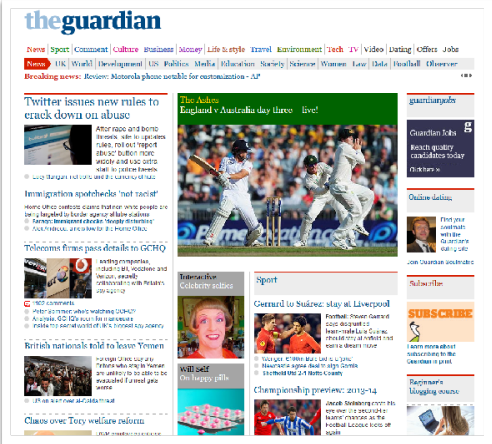
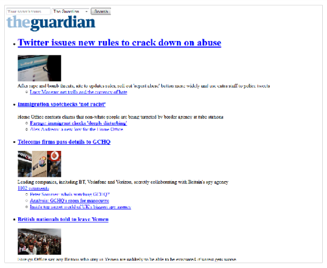
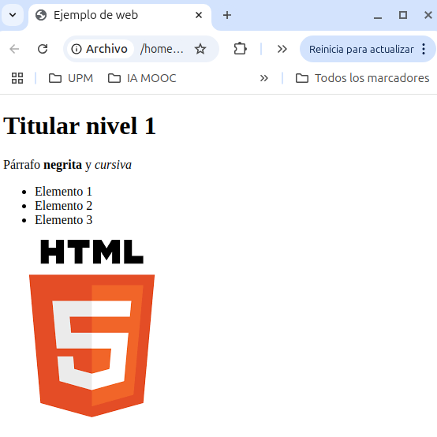
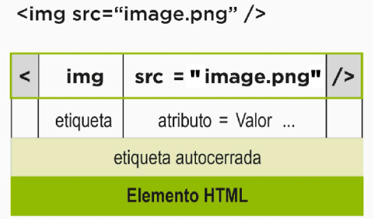
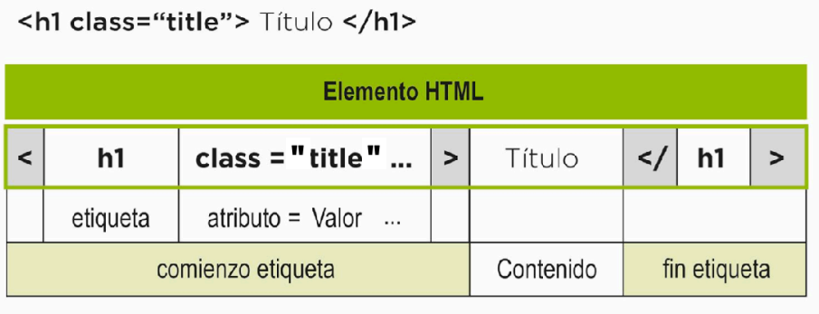
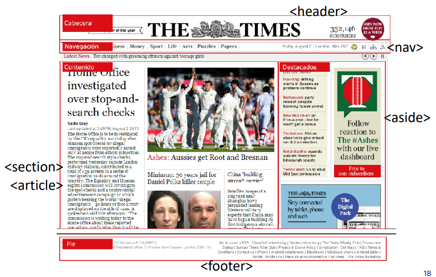

# HTML

HTML es un lengauje de marcas que sirve para formatear y estructurar el contenido de una página web. Las marcas se emplean para el estructurado semántico del contenido, es decir, para indicar el significado de cada parte de la página. La estructura HTML, debe realizarse en el sentido lógico de lectura del documento, cuando la página se vea sin aplicar los estilos no pierda su significado. Es importante preservar **la semántica de la página, ya que esto facilita la accesibilidad a personas con discapacidades visuales y auditivas**. Los lectores de pantalla, por ejemplo, interpretan el contenido de la página en función de las etiquetas HTML. 

Así, por ejemplo, una página web sin ningún tipo de estilo CSS se ve debe ver de la siguiente manera:

    
    

 

Como se puede observar, el contenido de la página se ve de manera estructurada y ordenada, a pesar de que no se ha aplicado ningún estilo.

En este curso se verá algunas etiquetas básicas HTML pero se recomienda consultar la documentación oficial de [Mozilla Developer Network](https://developer.mozilla.org/es/docs/Web/HTML) o [W3Schools](https://www.w3schools.com/) para conocer otras etiquetas y atributos que se pueden utilizar.

## Estructura página web

Todas las páginas web tienen una estructura básica que se compone de las siguientes partes:

    

        

            <pre>
&lt;!doctype html&gt;
&lt;html&gt;
&lt;head&gt;
  &lt;meta charset="utf-8"&gt;
  &lt;title&gt;Ejemplo de web&lt;/title&gt;
&lt;/head&gt;
&lt;body&gt;
  &lt;h1&gt; Titular nivel 1 &lt;/h1&gt;
  &lt;p&gt;
    Párrafo &lt;b&gt; negrita &lt;/b&gt; 
    y &lt;em&gt; cursiva &lt;/em&gt;
  &lt;/p&gt;
  &lt;ul&gt;
    &lt;li&gt; Elemento 1 &lt;/li&gt;
    &lt;li&gt; Elemento 2 &lt;/li&gt;
    &lt;li&gt; Elemento 3 &lt;/li&gt;
  &lt;/ul&gt;
  &lt;img src="imagen.png" /&gt;
&lt;/body&gt;
&lt;/html&gt;
            </pre>
        

    

    

        

            
                &#8594;
            
        

    

    

        

            
        

    
    

Cada una de las etiquetas tiene una función específica:

- `<!doctype html>`: Indica que el documento es de tipo HTML5.
- `<html>`: Define el documento HTML.
- `<head>`: Contiene información sobre el documento, como el título, metadatos, enlaces a estilos y scripts. Por ejemplo:
    - `<meta charset="utf-8">`: Define la codificación de caracteres del documento.
    - `<title>`: Define el título de la página. Se puede ver en la pestaña del navegador
- `<body>`: Contiene el contenido de la página. Es decir, lo que se muestra en el navegador. Aquí es donde se definen los elementos de la página que veremos a continuación.
- `<h1>`, `
`, `<ul>`... son etiquetas que definen los diferentes elementos de la página.

Cada una de estas etiquetas tiene un significado y un propósito específico. Además como podemos observar, **las etiquetas se anidan unas dentro de otras, formando una estructura jerárquica**. Las etiquetas además pueden tener atributos que permiten modificar su comportamiento o apariencia.

### Atributos de las etiquetas

Las etiquetas de HTML pueden ser autocerradas o no. Las etiquetas autocerradas no tienen contenido y se cierran con un slash `/`. Por ejemplo, `` es una etiqueta autocerrada que se utiliza para insertar imágenes en la página. Pero dentro de la etiqueta no se anidan otros elementos o texto. 

    

 

En cambio en las etiquetas que no son autocerradas, como `
`, `<h1>`, `<ul>`, etc., se puede anidar texto y otras etiquetas.

    

 

Como se puede observar, las etiquetas además peden poseer una serie de atributos que permiten modificar su comportamiento o apariencia. Por ejemplo, la etiqueta `` tiene el atributo `src` que indica la ruta de la imagen que se va a mostrar. Pero por lo general **los dos atributos más usados son**:

- `id`: Permite identificar un elemento de la página. Se utiliza principalmente para seleccionar elementos con JavaScript. También se puede utilizar para dotar estilos CSS a un elemento en concreto pero esta práctica no es recomendable y se recomienda usar `class`.
- `class`: Permite asignar una clase a un elemento. Las clases se utilizan para aplicar un mismo estilo CSS a varios elementos de la página a la vez. Pero también sirve para seleccionar elementos con JavaScript.

**Es importante tener en cuenta que los atributos de las etiquetas deben ir entre comillas dobles**. Por ejemplo, `id="miId"`, `class="miClase"`, etc. Existen otros muchos atributos como `href`, `alt`, `title`, `style`, `width`, `height`, etc. que se pueden utilizar en función de la etiqueta. Para ver que hace cada etiqueta o definir atributos personalizados se recomienda consultar la documentación oficial. E incluso se pueden definir atributos personalizados también mediante el uso de `data-` seguido del nombre del atributo.

Por otro lado, existen una serie de caracteres especiales que no se pueden escribir directamente en el código HTML, ya que algunos de ellos tienen un significado especial en el lenguaje. Para poder escribir estos caracteres en el código HTML se utilizan entidades HTML o códigos numéricos. Estos caracteres son los siguientes:

| Carácter | Nombre | Código HTML | Código Numérico |
|----------|--------|------------|----------------|
| &        | Ampersand | `&amp;` | `&#38;` |
| <        | Menor que | `&lt;` | `&#60;` |
| >        | Mayor que | `&gt;` | `&#62;` |
| "        | Comillas dobles | `&quot;` | `&#34;` |
| '        | Comillas simples (apóstrofe) | `&apos;` | `&#39;` |
| ®        | Marca registrada | `&reg;` | `&#174;` |
| €        | Euro | `&euro;` | `&#8364;` |
| ±        | Más-menos | `&plusmn;` | `&#177;` |
| ×        | Multiplicación | `&times;` | `&#215;` |
| ÷        | División | `&divide;` | `&#247;` |
| ♥        | Corazón | `&hearts;` | `&#9829;` |

## Etiquetas básicas

Existen etiquetas de varios tipos: de texto, de listas, de enlaces, de imágenes, de tablas, de formularios, etc. A continuación se muestran algunas de las etiquetas más comunes.

### Textos

#### Titulares

Existen hasta 6 niveles de titulares, desde `<h1>` hasta `<h6>`. Se utilizan para definir la jerarquía de los titulares de la página. Por ejemplo, `<h1>` es el titular más importante y `<h6>` el menos importante.

    

        

            <pre>
&lt;h1&gt;Titular nivel 1&lt;/h1&gt;
&lt;h2&gt;Titular nivel 2&lt;/h2&gt;
&lt;h3&gt;Titular nivel 3&lt;/h3&gt;
&lt;h4&gt;Titular nivel 4&lt;/h4&gt;
&lt;h5&gt;Titular nivel 5&lt;/h5&gt;
&lt;h6&gt;Titular nivel 6&lt;/h6&gt;
            </pre>
        

    

    

        

            
                &#8594;
            
        

    

    

        

            <h1>Titular nivel 1</h1>
            <h2>Titular nivel 2</h2>
            <h3>Titular nivel 3</h3>
            <h4>Titular nivel 4</h4>
            <h5>Titular nivel 5</h5>
            <h6>Titular nivel 6</h6>
        

    
    

#### Párrafos

Los parrafos se definen con la etiqueta `
`. Se utilizan para agrupar texto en párrafos. Automaticamente se añade un espacio en blanco antes y después del párrafo.

    

        

            <pre>
&lt;p&gt;Parrafo de texto 1&lt;/p&gt;
&lt;p&gt;Parrafo de texto 2&lt;/p&gt;
            </pre>
        

    

    

        

            
                &#8594;
            
        

    

    

        

            
Parrafo de texto 1

            
Parrafo de texto 2

        

    
    

#### Cadenas de texto

Las cadenas de texto se definen con la etiqueta ``. Se utilizan para aplicar estilos a un fragmento de texto en concreto.

    

        

            <pre>
&lt;span&gt;Cadena 1&lt;/span&gt;
&lt;span&gt;Cadena 2&lt;/span&gt;
            </pre>
        

    

    

        

            
                &#8594;
            
        

    

    

        

            Cadena 1
            Cadena 2
        

    
    

#### Citas textuales

Las citas textuales se definen con la etiqueta `<blockquote>`. Se utilizan, por lo general, para citar un fragmento de texto de otro autor.

    

        

            <pre>
&lt;blockquote&gt;
En un lugar de la mancha...
&lt;/blockquote&gt;
            </pre>
        

    

    

        

            
                &#8594;
            
        

    

    

        

            <blockquote>En un lugar de la mancha...</blockquote>
        

    
    

Se le puede añadir el atributo `cite` para indicar la fuente de la cita a través de una URL.

#### Enfatizadores de texto

    

        

            <pre>
&lt;b&gt;texto en negrita&lt;/b&gt;
&lt;i&gt;texto en itálica&lt;/i&gt;
&lt;u&gt;texto subrayado&lt;/u&gt;
&lt;s&gt;texto tachado&lt;/s&gt;
&lt;code&gt;código fuente&lt;/code&gt;
&lt;samp&gt;salida de un programa&lt;/samp&gt;
&lt;kbd&gt;entrada por teclado&lt;/kbd&gt;
&lt;var&gt;nombre de variable&lt;/var&gt;
&lt;dfn&gt;definición&lt;/dfn&gt;
&lt;cite&gt;título de un trabajo&lt;/cite&gt;
&lt;q&gt;cita breve&lt;/q&gt;
&lt;small&gt;texto más pequeño&lt;/small&gt;
texto&lt;sub&gt;subíndice&lt;/sub&gt;
texto&lt;sup&gt;superíndice&lt;/sup&gt;
            </pre>
        

    

    

        

            
                &#8594;
            
        

    

    

        

            <b>texto en negrita</b> 
            <i>texto en itálica</i> 
            <u>texto subrayado</u> 
            <s>texto tachado</s> 
            <code>código fuente</code> 
            <samp>salida de un programa</samp> 
            <kbd>entrada por teclado</kbd> 
            <var>nombre de variable</var> 
            <dfn>definición</dfn> 
            <cite>título de un trabajo</cite> 
            <q>cita breve</q> 
            <small>texto más pequeño</small> 
            textosubíndice 
            textosuperíndice 
        

    
    

#### Otras

Existen otras etiquetas que se pueden utilizar para formatear el texto: 

- La etiqueta `
` se utiliza para insertar una línea horizontal en la página. 
- La etiqueta ` ` se utiliza para insertar un salto de línea. 
- La etiqueta `<pre>` se utiliza para mostrar texto preformateado, es decir, tal y como se ha escrito en el código. 
- La etiqueta `<address>` se utiliza para mostrar información de contacto.

### Listas

#### Lista numerada

Una lista numerada se define con la etiqueta `<ol>`. Cada elemento de la lista se define con la etiqueta `<li>`.

    

        

            <pre>
&lt;ol&gt;
    &lt;li&gt;Elemento 1&lt;/li&gt;
    &lt;li&gt;Elemento 2&lt;/li&gt;
    &lt;li&gt;Elemento 3&lt;/li&gt;
&lt;/ol&gt;
            </pre>
        

    

    

        

            
                &#8594;
            
        

    

    

        

            <ol>
                <li>Elemento 1</li>
                <li>Elemento 2</li>
                <li>Elemento 3</li>
            </ol>
        

    
    

#### Lista no numerada

Una lista numerada se define con la etiqueta `<ul>`. Cada elemento de la lista se define con la etiqueta `<li>`.

    

        

            <pre>
&lt;ul&gt;
    &lt;li&gt;Elemento 1&lt;/li&gt;
    &lt;li&gt;Elemento 2&lt;/li&gt;
    &lt;li&gt;Elemento 3&lt;/li&gt;
&lt;/ul&gt;
            </pre>
        

    

    

        

            
                &#8594;
            
        

    

    

        

            <ul>
                <li>Elemento 1</li>
                <li>Elemento 2</li>
                <li>Elemento 3</li>
            </ul>
        

    
    

#### Lista de descripciones

Una lista de descripciones se define con la etiqueta `<dl>`. Cada término se define con la etiqueta `<dt>` y su descripción con la etiqueta `<dd>`.

    

        

            <pre>
&lt;dl&gt;
    &lt;dt&gt;Termino 1&lt;/dt&gt;
    &lt;dd&gt;Su descripcion&lt;/dd&gt;
    &lt;dt&gt;Termino 2&lt;/dt&gt;
    &lt;dd&gt;Su descripcion&lt;/dd&gt;
&lt;/dl&gt;
            </pre>
        

    

    

        

            
                &#8594;
            
        

    

    

        

            <dl>
                <dt>Término 1</dt>
                <dd>Su descripción</dd>
                <dt>Término 2</dt>
                <dd>Su descripción</dd>
            </dl>
        

    
    

### Tablas

Las tablas se definen con las etiquetas `<table>`, `<tr>`, `<th>` y `<td>`. La etiqueta `<table>` define la tabla, `<tr>` define una fila, `<th>` define una celda de cabecera y `<td>` define una celda de datos. La primera fila de la tabla se suele utilizar para definir los títulos de las columnas.

    

        

            <pre>
&lt;table&gt;
 &lt;tr&gt;
 &lt;th&gt; &lt;/th&gt;
 &lt;th&gt; Población &lt;/th&gt;
 &lt;th&gt; Hombres &lt;/th&gt;
 &lt;th&gt; Mujeres &lt;/th&gt;
 &lt;/tr&gt;
 &lt;tr&gt;
 &lt;th&gt; Alemania &lt;/th&gt;
 &lt;td&gt; 82.020.578 &lt; /td&gt;
 &lt;td&gt; 40.346.853 &lt;/td&gt;
 &lt;td&gt; 41.673.725 &lt;/td&gt;
 &lt;/tr&gt;
 &lt;tr&gt;
 &lt;th&gt; Francia &lt;/th&gt;
 &lt;td&gt; 65.578.819 &lt;/td&gt;
 &lt;td&gt; 31.764.615 &lt;/td&gt;
 &lt;td&gt; 33.814.204 &lt;/td&gt;
 &lt;/tr&gt;
 &lt;tr&gt;
 &lt;th&gt; Reino Unido &lt;/th&gt;
 &lt;td&gt; 63.896.071 &lt;/td&gt;
 &lt;td&gt; 31.423.339 &lt;/td&gt;
 &lt;td&gt; 32.472.732 &lt;/td&gt;
 &lt;/tr&gt;
&lt;/table&gt;
            </pre>
        

    

    

        

            
                &#8594;
            
        

    

    

        

            <table>
 <tr>
 <th> </th>
 <th> Población </th>
 <th> Hombres </th>
 <th> Mujeres </th>
 </tr>
 <tr>
 <th> Alemania </th>
 <td> 82.020.578 < /td>
 <td> 40.346.853 </td>
 <td> 41.673.725 </td>
 </tr>
 <tr>
 <th> Francia </th>
 <td> 65.578.819 </td>
 <td> 31.764.615 </td>
 <td> 33.814.204 </td>
 </tr>
 <tr>
 <th> Reino Unido </th>
 <td> 63.896.071 </td>
 <td> 31.423.339 </td>
 <td> 32.472.732 </td>
 </tr>
</table>
        

    
    

### Navegacion

Para dotar de navegación a la página web se utilizan las etiquetas `<a>` y `<nav>`. La etiqueta `<a>` se utiliza para definir un enlace a otra página web o a otra parte de la misma página. El principal atributo de la etiqueta `<a>` es `href`, que indica la URL a la que enlaza el enlace. La url puede referenciar a un archivo local, a una página web, a una sección de la misma página, a un correo electrónico, etc.

    

        

            <pre>
&lt;a href="https://www.google.es/"&gt;Ir a Google&lt;/a&gt;
&lt;a href="mailto:nombre@email.com"&gt;Contacto&lt;/a&gt;
&lt;a href="pagina2.html"&gt;Página 2&lt;/a&gt;
&lt;a href="#nombre"&gt;Ir a nombre&lt;/a&gt;
            </pre>
        

    

    

        

            
                &#8594;
            
        

    

    

        

            <a href="https://www.google.es/">Ir a Google</a> 
            <a href="mailto:nombre@email.com">Contacto</a> 
            <a href="pagina2.html">Página 2</a> 
            <a href="#nombre">Ir a nombre</a> 
        

    
    

Al clickar en el enlace, el navegador redirigirá a la página web indicada en el atributo `href`. Si el enlace es a una sección de la misma página, el navegador se desplazará a la sección indicada en el atributo `href`.

La etiqueta `<nav>` se utiliza para definir la navegación de la página. Basicamente se utiliza para agrupar los enlaces de la página que servirán como el menú de navegación de la página.

    

        

            <pre>
&lt;nav&gt;
  &lt;ul&gt;
    &lt;li&gt;
      &lt;a href="index.html"&gt;Inicio&lt;/a&gt;
    &lt;/li&gt;
    &lt;li&gt;
      &lt;a href="news.html"&gt;Noticias&lt;/a&gt;
    &lt;/li&gt;
    &lt;li&gt;
      &lt;a href="contacto.html"&gt;Contacto&lt;/a&gt;
    &lt;/li&gt;
    &lt;li&gt;
      &lt;a href="about.html"&gt;Sobre nosotros&lt;/a&gt;
    &lt;/li&gt;
  &lt;/ul&gt;
&lt;/nav&gt;
            </pre>
        

    

    

        

            
                &#8594;
            
        

    

    

        

            <nav>
                <ul>
                <li><a href="index.html">Inicio</a></li>
                <li><a href="news.html">Noticias</a></li>
                <li><a href="contacto.html">Contacto</a></li>
                <li><a href="about.html">Sobre nosotros</a></li>
                </ul>
            </nav>
        

    
    

### Formularios

Para hacer un formulario se utiliza las etiqueta `<form>`. Esta etiqueta debe contener dos atributos principalmente: 

- `action`: Indica la URL a la que se enviarán los datos del formulario.
- `method`: Indica el método HTTP de envío de los datos, que puede ser `GET` o `POST`. Esto se verá más adelante.

Dentro de la etiqueta `<form>` se pueden incluir diferentes tipos de campos de formulario, como campos de texto, botones, casillas de verificación, botones de radio, menús desplegables, etc. Las etiquetas más comunes son:

- `label`: Se utiliza para definir una etiqueta para un campo de formulario. Por lo general, se utiliza para indicar el nombre del campo.
- `<input>`: Se utiliza para crear campos de texto, botones, casillas de verificación, botones de radio, etc. Tiene varios tipos, como `text`, `number`, `checkbox`, `radio`, `date`, `email`, `password`, `file`, etc. Existe el tipo `submit` para enviar el formulario y el tipo `reset` para borrar los datos del formulario.
- `<textarea>`: Se utiliza para crear campos de texto de varias líneas.
- `<select>`: Se utiliza para crear menús desplegables. Cada opción del menú se define con la etiqueta `<option>`.
- `<button>`: Se utiliza para crear botones. Por lo general se definirá un botón de tipo `submit` para enviar el formulario y un botón de tipo `reset` para borrar los datos del formulario.

    

        

            <pre>
&lt;form action="/submit" method="POST"&gt;
  &lt;label&gt;Nombre:&lt;/label&gt;
  &lt;input type="text" name="nombre" &gt;
  &lt;label&gt;Edad:&lt;/label&gt;
  &lt;input type="number" name="edad"&gt;
  &lt;label&gt;Estudiante:&lt;/label&gt;
  &lt;input type="checkbox" name="estudiante"&gt;
  &lt;label&gt;Nacimiento:&lt;/label&gt;
  &lt;input type="date" name="nacimiento"&gt;
  &lt;label&gt;Descripcion:&lt;/label&gt;
  &lt;textarea name="descripcion"&gt;
  &lt;/textarea&gt;
  &lt;label&gt;Color de pelo:&lt;/label&gt;
  &lt;select name="color"&gt;
    &lt;option value="rubio"&gt;Rubio&lt;/option&gt;
    &lt;option value="moreno"&gt;Moreno&lt;/option&gt;
    &lt;option value="pelirrojo"&gt;Pelirrojo&lt;/option&gt;
  &lt;/select&gt;
  &lt;button type="submit"&gt;Enviar&lt;/button&gt;
  &lt;button type="reset"&gt;Borrar&lt;/button&gt;
&lt;/form&gt;
            </pre>
        

    

    

        

            
                &#8594;
            
        

    

    

        

            <form action="/submit" method="POST">
                <label>Nombre:</label>
                <input type="text" name="nombre" value="" placeholder="su nombre">
                <label>Edad:</label>
                <input type="number" name="edad" value="" placeholder="su edad">
                <label>Estudiante:</label>
                <input type="checkbox" name="estudiante" value="" required>
                <label>Nacimiento:</label>
                <input type="date" name="nacimiento" value="" required>
                <label>Descripcion:</label>
                <textarea name="descripcion" value=""></textarea>
                <label>Color de pelo:</label>
                <select name="color">
                    <option value="rubio">Rubio</option>
                    <option value="moreno">Moreno</option>
                    <option value="pelirrojo">Pelirrojo</option>
                </select>
                 
                <button type="submit">Enviar</button>
                <button type="reset">Borrar</button>
            </form>
        

    
    

A parte, cada una de estas etiquetas puede tener una serie de atributos como:

- `name`: Nombre del campo. El más relevante. Se utiliza para identificar el campo en el servidor cuando se envie la petición.
- `value`: Valor del campo. Se utiliza para definir el valor por defecto del campo. 
- `placeholder`: Texto de ayuda que se muestra en el campo cuando está vacío.
- `required`: Indica que el campo es obligatorio y el formulario no se puede enviar si no se rellena.
- `disabled`: Indica que el campo está deshabilitado y no se puede modificar.
- `min`, `max`, `step`: Atributos para campos numéricos.

### Bloques

En HTML existen una serie de etiquetas que como tal no tienen un significado semántico pero que se utilizan para agrupar elementos de la página. Estas etiquetas estan contenidas dentro de la etiqueta `<body>`. Algunas de estas etiquetas son:

- `<header>`: Se utiliza para definir la cabecera de la página. Por lo general, se utiliza para incluir el logotipo, el menú de navegación, etc.
- `<footer>`: Se utiliza para definir el pie de la página. Por lo general, se utiliza para incluir información de contacto, enlaces a redes sociales, etc.
- `<section>`: Se utiliza para definir secciones de la página. Por lo general, se utiliza para agrupar elementos relacionados.
- `<article>`: Se utiliza para definir un artículo de la página. Por lo general, se utiliza para agrupar elementos que forman una unidad.
- `<aside>`: Se utiliza para definir contenido secundario de la página. Por lo general, se utiliza para incluir elementos como barras laterales, anuncios, etc.
- `<nav>`: Se utiliza para definir la navegación de la página. Por lo general, se utiliza para agrupar los enlaces de navegación de la página.
- `
`: Se utiliza para agrupar elementos de la página. Se utiliza para definir bloques de contenido. **Se trata de un de las etiquetas más usadas en HTML**.

    

### Multimedia

#### Imágenes

Las imágenes se definen con la etiqueta ``. Las imágenes poseen varios atributos como:

- El atributo `src` indica la ruta de la imagen que se va a mostrar.  Puede ser una URL, una ruta relativa o una ruta absoluta a un fichero en el servidor. 
- El atributo `alt` se utiliza para definir un texto alternativo que se muestra si la imagen no se puede cargar. Se trata de un atributo bastante importante ya que ayuda a la accesibilidad de la página.
- El atributo `width` y `height` se utiliza para definir el ancho y el alto de la imagen. Aunque esto se recomienda hacerlo direcamnete en el CSS.

    

        

            <pre>
&lt;h1&gt;HTML&lt;/h1&gt;
&lt;img src="html.jpg" alt="HTML"/&gt;
            </pre>
        

    

    

        

            
                &#8594;
            
        

    

    

        

            <h1>HTML</h1>
            
        

    
    

Para hacer imágenes responsive se puede usar la etiqueta `<picture>` que permite definir diferentes imágenes para diferentes tamaños de pantalla.

#### Videos

Los videos se definen con la etiqueta `<video>`. Los videos poseen varios atributos como:

- El atributo `src` indica la ruta del video que se va a mostrar. Puede ser una URL, una ruta relativa o una ruta absoluta a un fichero en el servidor.
- El atributo `controls` se utiliza para mostrar los controles del video, como el botón de reproducción, el botón de pausa, la barra de progreso, etc.
- El atributo `autoplay` se utiliza para reproducir el video automáticamente al cargar la página.
- El atributo `loop` se utiliza para reproducir el video en bucle.
- El atributo `muted` se utiliza para silenciar el video.

    

        

            <pre>
&lt;h1&gt;Video&lt;/h1&gt;
&lt;video src="video.mp4" autoplay 
controls&gt;&lt;/video&gt;
            </pre>
        

    

    

        

            
                &#8594;
            
        

    

    

        

            <h1>Video</h1>
            <video src="video.mp4" autoplay controls></video>
        

    
    

Los vídeos se pueden mostrar en diferentes formatos, como MP4, WebM, OGG, etc. Para que el video se pueda reproducir en todos los navegadores, se recomienda incluir el video en varios formatos.

#### Audios

Los audios se definen con la etiqueta `<audio>`. Los audios poseen varios atributos como:

- El atributo `src` indica la ruta del audio que se va a mostrar. Puede ser una URL, una ruta relativa o una ruta absoluta a un fichero en el servidor.
- El atributo `controls` se utiliza para mostrar los controles del audio, como el botón de reproducción, el botón de pausa, la barra de progreso, etc.
- El atributo `autoplay` se utiliza para reproducir el audio automáticamente al cargar la página.
- El atributo `loop` se utiliza para reproducir el audio en bucle.
- El atributo `muted` se utiliza para silenciar el audio.

    

        

            <pre>
&lt;h1&gt;Audio&lt;/h1&gt;
&lt;audio src="audio.mp3" controls 
autoplay loop&gt;&lt;/audio&gt;
            </pre>
        

    

    

        

            
                &#8594;
            
        

    

    

        

            <h1>Audio</h1>
            <audio src="audio.mp3" controls autoplay loop></audio>
        

    
    

Los audios también se pueden controlar con JavaScript para añadir funcionalidades como el volumen, la velocidad de reproducción, etc.

---

Hasta aqui se han explicado algunas cosas básicas de HTML. Por supuesto, existen un montón más de etiquetas y atributos que se pueden utilizar en HTML. HTML es un lenguaje de marcado que se utiliza para definir la estructura de una página web y por tanto, **lo más importante es saber estrucutrar y anidar todas las etiquetas de forma correcta** y como interactuan entre ellas.

