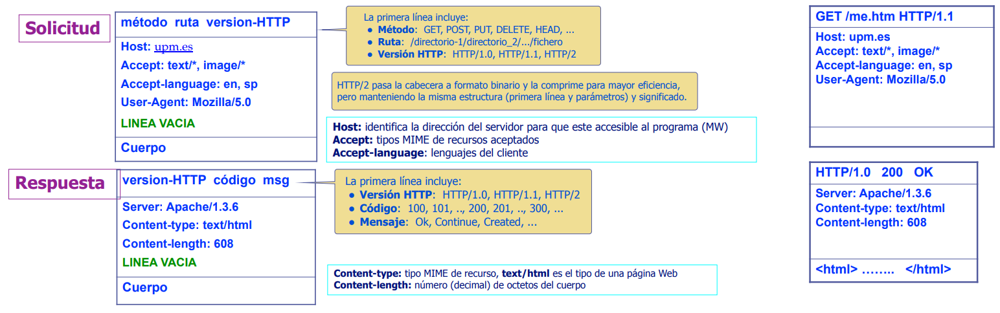
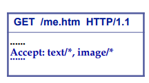
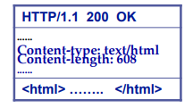

# HTTP

Como se ha comentado previamente la mayoría de los servidores estan basados en el protocolo HTTP. Se trata de un protocolo que se utiliza para la transmisión de información en la web. Pertenece a la capa de aplicación del modelo OSI y generalmente va sobre TCP/IP.

HTTP es un protocolo transaccional solicitud-respuesta sin estado, diseñado para acceder a páginas web y otros servicios de Internet. La transacción HTTP siempre se inicia desde el lado cliente, que establece o reutiliza una conexión con el servidor. A través de esta conexión, el cliente envía solicitudes HTTP y el servidor responde con las correspondientes respuestas.

<p class="no-margin-bottom">El cliente identifica el servicio solicitado al servidor mediante el método y la ruta de la petición HTTP enviada.
Los servidores pueden ofrecer dos tipos de servicios: estático y programable.</p>
  
  - La interfaz con el **servicio estático** sirve recursos estáticos (como ficheros). Las peticiones a este servicio son de tipo `GET` y la ruta identifica la parte del fichero a servir. Las rutas a los recursos estáticos no deben coincidir con las del servidor programable.
  
  - La interfaz con el **servicio programable** gestiona los recursos almacenados en una base de datos (BBDD). Utiliza una interfaz uniforme y las rutas identifican los recursos de manera unívoca.

Desde su primera versión, HTTP ha evolucionado pasando por HTTP/0.9, HTTP/1.0, HTTP/1.1, HTTP/2 y HTTP/3. Actualmente, HTTP/1.1 es la versión más utilizada, introduciendo mejoras como la persistencia de conexión, paralelismo en las solicitudes y respuestas en fragmentos (*chunked*). Además, permite atravesar proxies que agregan funcionalidades como caché. 

HTTP/2, lanzado en 2015, optimiza la latencia y la prioridad de peticiones, mientras que HTTP/3 reemplaza TCP por QUIC sobre UDP, reduciendo la latencia y permitiendo flujos separados con una mejor corrección de errores.

## Estructura de una petición y respuesta HTTP

Tanto la solicitud como la respuesta siguen el mismo formato, compuesto por una primera línea de parámetros básicos, las cabeceras, una línea en blanco y un cuerpo.

<div class="img-center">
    
</div>

La primera línea de la solicitud muestra el recurso solicitado, que **corresponde principalmente al path en la sintaxis de la URL**. Además, en la solicitud se configuran otros elementos, como el método, que se detallará a continuación. En la respuesta, la primera línea incluye el código de estado, el cual también será explicado más adelante.

### Métodos HTTP

HTTP tiene varios métodos que definen las acciones que se pueden realizar sobre un recurso. Los principales **permiten realizar un CRUD (Create, Read, Update y Delete) sobre el recurso** y son:

<table border="1">
    <tr>
        <th>Operación</th>
        <th>Descripción</th>
    </tr>
    <tr>
        <td><strong>GET</strong></td>
        <td>Obtiene información sobre un recurso.</td>
    </tr>
    <tr>
        <td><strong>POST</strong></td>
        <td>Crea un nuevo recurso.</td>
    </tr>
    <tr>
        <td><strong>PUT</strong></td>
        <td>Actualiza un recurso.</td>
    </tr>
    <tr>
        <td><strong>DELETE</strong></td>
        <td>Elimina un recurso.</td>
    </tr>
</table>


Además de estos métodos, existen otros como:


<table border="1">
    <tr>
        <th>Operación</th>
        <th>Descripción</th>
    </tr>
    <tr>
        <td><strong>HEAD</strong></td>
        <td>Obtiene la cabecera de un recurso.</td>
    </tr>
    <tr>
        <td><strong>OPTIONS</strong></td>
        <td>Obtiene los métodos permitidos sobre un recurso.</td>
    </tr>
    <tr>
        <td><strong>PATCH</strong></td>
        <td>Actualiza parcialmente un recurso.</td>
    </tr>
    <tr>
        <td><strong>TRACE</strong></td>
        <td>Devuelve la petición recibida.</td>
    </tr>
    <tr>
        <td><strong>CONNECT</strong></td>
        <td>Convierte la conexión en un túnel.</td>
    </tr>
</table>


### Códigos de estado

Los códigos de estado son una parte importante de la respuesta HTTP, ya que indican el resultado de la solicitud Los códigos de estado se dividen en cinco categorías:

<table>
  <thead>
    <tr>
      <th>Clase</th>
      <th>Código</th>
      <th>Descripción</th>
      <th>Mensaje</th>
    </tr>
  </thead>
  <tbody>
    <tr>
      <td rowspan="1">Respuestas informativas (1xx)</td>
      <td>100</td>
      <td>Continue</td>
      <td>Continuar solicitud parcial</td>
    </tr>
    <tr>
      <td rowspan="3">Solicitud finalizada (2xx)</td>
      <td>200</td>
      <td>OK</td>
      <td>Operación finalizada con éxito, recurso servido</td>
    </tr>
    <tr>
      <td>201</td>
      <td>Created</td>
      <td>Recurso creado o actualizado con éxito</td>
    </tr>
    <tr>
      <td>206</td>
      <td>Partial Content</td>
      <td>Para uso con GET parcial</td>
    </tr>
    <tr>
      <td rowspan="3">Redirección (3xx)</td>
      <td>301</td>
      <td>Moved Permanently</td>
      <td>Recurso en otro servidor, actualizar el URL</td>
    </tr>
    <tr>
      <td>303</td>
      <td>See Other</td>
      <td>Envía la URI del documento de respuesta</td>
    </tr>
    <tr>
      <td>304</td>
      <td>Not Modified</td>
      <td>Cuando el cliente ya tiene los datos</td>
    </tr>
    <tr>
      <td rowspan="5">Error de cliente (4xx)</td>
      <td>400</td>
      <td>Bad request</td>
      <td>Comando enviado incorrecto</td>
    </tr>
    <tr>
      <td>404</td>
      <td>Not Found</td>
      <td>Recurso no encontrado en repositorio</td>
    </tr>
    <tr>
      <td>405</td>
      <td>Method Not Allowed</td>
      <td>Método no soportado por este servidor</td>
    </tr>
    <tr>
      <td>409</td>
      <td>Conflict</td>
      <td>Conflicto con el estado del recurso</td>
    </tr>
    <tr>
      <td>410</td>
      <td>Gone</td>
      <td>Recurso ya no está</td>
    </tr>
    <tr>
      <td>Error de Servidor (5xx)</td>
      <td>500</td>
      <td>Internal Server Error</td>
      <td>El servidor tiene errores</td>
    </tr>
  </tbody>
</table>


### Cabeceras

Las cabeceras son metadatos que se envían en la solicitud y la respuesta HTTP. Estas cabeceras proporcionan información adicional sobre la solicitud o la respuesta, como el tipo de contenido, la longitud del contenido, la codificación, la fecha, etc. La siguiente tabla recoge algunas cabeceras comunes:

<table>
  <thead>
    <tr>
      <th>Cabecera</th>
      <th>Descripción</th>
    </tr>
  </thead>
  <tbody>
    <tr>
      <td>Host</td>
      <td>Indica el nombre de dominio del cliente (y opcionalmente el puerto). Para que sea accesible por el programa servidor.</td>
    </tr>
    <tr>
      <td>Content-type</td>
      <td>Tipo de medio (MIME) del recurso presente en el cuerpo ("text/html", "image/png").</td>
    </tr>
    <tr>
      <td>Content-length</td>
      <td>Longitud en bytes del cuerpo del mensaje.</td>
    </tr>
    <tr>
      <td>Accept</td>
      <td>Especifica los tipos de medios (MIME) que el cliente puede aceptar.</td>
    </tr>
    <tr>
      <td>Accept-language</td>
      <td>Idiomas que el cliente prefiere para el contenido.</td>
    </tr>
    <tr>
      <td>Connection</td>
      <td>Solicita que la conexión HTTP permanezca abierta (keep-alive) o se cierre (close) al finalizar la transacción.</td>
    </tr>
    <tr>
      <td>Transfer-encoding</td>
      <td>Codificación para un enlace.</td>
    </tr>
    <tr>
      <td>Content-encoding</td>
      <td>Codificación extremo a extremo aplicada al contenido del cuerpo.</td>
    </tr>
    <tr>
      <td>Cookie</td>
      <td>Envía información almacenada en cookies desde el cliente al servidor.</td>
    </tr>
    <tr>
      <td>Authorization</td>
      <td>Proporciona credenciales para autenticar al usuario.</td>
    </tr>
    <tr>
      <td>Etag, Last-modified, If-none-match, If-modified-since</td>
      <td>Gestión de la cache.</td>
    </tr>
    <tr>
      <td>Accept-Encoding</td>
      <td>Indica las codificaciones de contenido que el cliente puede entender y procesar.</td>
    </tr>
    <tr>
      <td>Cache-Control</td>
      <td>Controla cómo se almacena en caché el contenido en el navegador o en intermediarios.</td>
    </tr>
    <tr>
      <td>Content-Disposition</td>
      <td>Indica si el contenido debe mostrarse en línea o descargarse como un archivo.</td>
    </tr>
    <tr>
      <td>Date</td>
      <td>Indica la fecha y hora en que se generó la respuesta.</td>
    </tr>
    <tr>
      <td>Location</td>
      <td>Utilizado en respuestas de redirección para indicar la nueva ubicación del recurso.</td>
    </tr>
    <tr>
      <td>Origin</td>
      <td>Indica el origen de la solicitud HTTP, utilizado en políticas de seguridad del navegador.</td>
    </tr>
    <tr>
      <td>Referer</td>
      <td>Indica la URL de la cual provino la solicitud.</td>
    </tr>
    <tr>
      <td>Server</td>
      <td>Proporciona información sobre el servidor web que maneja la solicitud.</td>
    </tr>
    <tr>
      <td>Upgrade</td>
      <td>Indica la preferencia del cliente por una actualización de protocolo.</td>
    </tr>
    <tr>
      <td>User-Agent</td>
      <td>Identifica el software del usuario, como un navegador web.</td>
    </tr>
    <tr>
      <td>WWW-Authenticate</td>
      <td>En respuestas 401, indica el método de autenticación que debe ser utilizado.</td>
    </tr>
    <tr>
      <td>X-Content-Type-Options</td>
      <td>Configura cómo el navegador debe interpretar el tipo de contenido (MIME).</td>
    </tr>
    <tr>
      <td>X-Frame-Options</td>
      <td>Controla si un navegador debe permitir que una página sea renderizada dentro de un marco (iframe).</td>
    </tr>
    <tr>
      <td>X-Requested-With</td>
      <td>Identifica solicitudes AJAX, a menudo utilizado por frameworks JavaScript.</td>
    </tr>
    <tr>
      <td>X-XSS-Protection</td>
      <td>Configura la protección contra ataques de scripting entre sitios (XSS).</td>
    </tr>
    <tr>
      <td>Strict-Transport-Security</td>
      <td>Establece una política de seguridad para conexiones seguras (HTTPS).</td>
    </tr>
    <tr>
      <td>Access-Control-Allow-Origin</td>
      <td>Permite que un recurso sea solicitado desde un dominio diferente al que sirve el recurso (CORS).</td>
    </tr>
    <tr>
      <td>Content-Security-Policy</td>
      <td>Especifica fuentes permitidas de diversos tipos de contenido, ayuda a prevenir ataques de inyección de código malicioso.</td>
    </tr>
    <tr>
      <td>Retry-After</td>
      <td>Indica al cliente cuánto tiempo debe esperar antes de realizar una nueva solicitud después de recibir un código de estado de espera.</td>
    </tr>
  </tbody>
</table>


### Tipos de contenido

Los **Tipos MIME** (Multipurpose Internet Mail Extensions) definen el tipo de un recurso o fichero en distintos contextos, como correos electrónicos y la web. Su formato general es:

```
tipo/subtipo
```

Para más información sobre los tipos MIME, puedes consultar los siguientes recursos: [MDN Web Docs - MIME Types](https://developer.mozilla.org/ar/docs/Web/HTTP/Basics_of_HTTP/MIME_Types) o [File Extensions](https://www.file-extensions.org).

Los tipos MIME se incluyen en las cabeceras de las peticiones y las respuestas HTTP. Por lo general, los navegadores suelen incluir el tipo MIME en la cabecera `Content-Type` de las respuestas.


<div class="img-grid-line">
    
    
</div>

<br>

Algunos de los tipos MIME que más comunes son:

#### Tipo `text`
<p class="no-margin-bottom">Este tipo se usa para representar contenido textual en distintos formatos:</p>

- **text/plain**: Texto plano sin formato (por defecto si el formato es desconocido).
- **text/html**: Texto con estructura definida en HTML.
- **text/css**: Fichero de hojas de estilo CSS.
- **text/javascript**: Script en lenguaje JavaScript.

#### Tipo `image`
<p class="no-margin-bottom">Se usa para representar imágenes en distintos formatos:</p>

- **image/gif**: Imagen en formato GIF.
- **image/jpeg**: Imagen en formato JPEG.
- **image/png**: Imagen en formato PNG.
- **image/svg+xml**: Imagen en formato vectorial SVG.

#### Envío de parámetros en formularios
Los formularios web pueden enviar datos en distintos formatos:

- **application/x-www-form-urlencoded**: Parámetros codificados en URL-encoded.
- **multipart/form-data**: Parámetros enviados en múltiples formatos, utilizado para formularios con archivos adjuntos.

<br>


## RestFul

Como se ha comentado previamente un servidor basado en HTTP puede ofrecer recursos estáticos y programables. Estos recursos se ofrecen a través de un **path**, es decir /vias, /vias/1, /bloques, etc. En nuestro caso vamos a manejar tanto recursos estáticos como recursos programables. Para los recursos estaticos, veremos en el próximo tema como habilitar el servidor para servir ficheros. 

Para el caso de ahora, de servir recursos programables, es decir recursos que se gestionan a través de por ejemplo, una base de datos, es necesario definir una interfaz para acceder a estos recursos. Para ello se pueden seguir los principios de REST (Representational State Transfer) para definir una API web. REST es un estilo de arquitectura de software que define un conjunto de restricciones para la creación de servicios web. Restful es un servicio web que ha implementado los principios de REST:

1. **Arquitectura orientada a recursos**: Los recursos (datos o servicios) están representados por URLs únicas y accesibles a través de peticiones HTTP.
2. **Protocolo sin estado (stateless)**: Cada solicitud contiene toda la información necesaria para procesarla, sin depender del estado de solicitudes anteriores.
4. **Respuestas en formatos estándar**: Las respuestas son generalmente en formatos legibles y universales como JSON, XML o HTML.
5. **Comunicaciones mediante hipermedia**: Los usuarios interactúan con los recursos a través de enlaces (hiperlinks) que pueden modificar el estado de los recursos.
6. **Independencia entre cliente y servidor**: El cliente y el servidor interactúan mediante interfaces definidas, sin necesidad de conocer detalles internos del otro.

Se trata de una filosofía que esta directamente ligado a como se estructuras las rutas de nuestro servidor y se vertebra sobre 2 conceptos fundamentales:
- Método de HTTP. Permite definir la acción a realizar sobre el recurso. Se emplean las operaciones CRUD (Crear, Leer, Actualizar, Eliminar) mapeadas con los métodos HTTP (POST, GET, PUT, DELETE).
- /path de URl. Permite identificar el recurso sobre el que se va a realizar la acción.


Basicamente facilita el desarrollo del código al estructurarlo siguiendo esta filosofía ya que se pone un punto en común para todos los programadores del proyecto. Desde la perspectiva del cliente, también facilita la comprensión de la API ya que se siguen unos principios comunes y se usan los mismos métodos HTTP para realizar las mismas acciones sobre los recursos. Esto hace que la API sea más intuitiva y fácil de usar y que pueda haber una mayor interoperabilidad entre diferentes aplicaciones.
 
Así por ejemplo, para implementar una API Restful para gestionar las vías de un rocodromo habría que implementar las siguientes rutas:

<table border="1">
  <thead>
    <tr>
      <th>Método HTTP</th>
      <th>Endpoint</th>
      <th>Descripción</th>
      <th>Acción (CRUD)</th>
      <th>Ejemplo de Solicitud</th>
    </tr>
  </thead>
  <tbody>
    <tr>
      <td>GET</td>
      <td>/vias</td>
      <td>Obtiene todas las vías del rocódromo.</td>
      <td>Leer (Read)</td>
      <td>GET /vias</td>
    </tr>
    <tr>
      <td>POST</td>
      <td>/vias</td>
      <td>Crea una nueva vía en el rocódromo.</td>
      <td>Crear (Create)</td>
      <td>POST /vias { "nombre": "Via 1", "grado": "6b" }</td>
    </tr>
    <tr>
      <td>GET</td>
      <td>/vias/{id}</td>
      <td>Obtiene los detalles de una vía específica.</td>
      <td>Leer (Read)</td>
      <td>GET /vias/1</td>
    </tr>
    <tr>
      <td>PUT</td>
      <td>/vias/{id}</td>
      <td>Actualiza los detalles de una vía específica.</td>
      <td>Actualizar (Update)</td>
      <td>PUT /vias/1 { "nombre": "Via 1 Actualizada", "grado": "6c" }</td>
    </tr>
    <tr>
      <td>DELETE</td>
      <td>/vias/{id}</td>
      <td>Elimina una vía del rocódromo.</td>
      <td>Eliminar (Delete)</td>
      <td>DELETE /vias/1</td>
    </tr>
  </tbody>
</table>

Así, por ejemplo, para nuestro blueprint de vias, podríamos definir las siguientes rutas de la siguiente forma:

### List

Usaremos un array de diccionarios para simular una base de datos de vías como el que hemos visto en la sección anterior. Este array se pasará como parámetro a la plantilla de Jinja2 <code>list.html</code> para mostrar las vías en la página web.

```python
vias = [
    { "id": 1, "nombre": "Via 1", "grado": "6b" },
    { "id": 2, "nombre": "Via 2", "grado": "7a" },
    { "id": 3, "nombre": "Via 3", "grado": "6c" }
]

@via_bp.route('/', methods=['GET'])
def list():
    return render_template('via/list.html', vias=vias)
```

Y el fichero list.html tendrá un aspecto parecido a este:

```html



<div class="via">
    <h1>Vias</h1>
    <a href="/vias/new">Nueva Via</a>
    <table>
      <thead>
          <tr>
              <th>Nombre</th>
              <th>Grado</th>
          </tr>
      </thead>
      <tbody>
          
              <tr>
                  <td>{{ via.nombre }}</td>
                  <td>{{ via.grado }}</td>
                  <td>
                      <!-- Enlace para ver los detalles de una vía específica -->
                      <a href="/vias/{{ via.id }}">Ver</a> 

                      <!-- Enlace para editar los detalles de una vía específica -->
                      <a href="/vias/{{ via.id }}/edit">Editar</a>

                      <!-- Formulario para eliminar una vía -->
                      <form action="/vias/{{via.id}}/delete" method="post">
                        <!-- Campo oculto que se usa para simular el método HTTP DELETE en formularios -->
                        <input type="hidden" name="_method" value="DELETE" />
                        <!-- Botón para enviar el formulario y eliminar la vía -->
                        <button type="submit">Eliminar</button>
                      </form>
                  </td>
              </tr>
          
      </tbody>
    </table>
</div>



```
Se ha creado una tabla que lista todas las vias que estan en el array. Para cada una de ellas se ha añadido un enlace para ver los detalles de la vía, otro para editarla y un formulario para eliminarla. Se ha añadido un botón al inicio que redirige a un formulario para crear una nueva vía.

<blockquote>
<h4>Peticiones desde HTML con <code>a</code> y <code>form</code> </h4>
<p>
Cuando elusuario clica en una etiqueta de HTML <code>a</code> se envía una petición HTTP con el método GET. Así en el código anterior, cuando el usuario clica en el enlace "Ver" se envía una petición GET a la ruta <code>/vias/{{ via.id }}</code> para mostrar los detalles de la vía. 
</p>
<p>
En el caso de los formularios, por defecto se envía una petición POST aunque se debe indicar explícitamente el método HTTP que se quiere usar a través de <code>method</code> en la cabecera y a través de <code>action</code> la ruta a la que se quiere enviar la petición. Los formularios también pueden enviar peticiones GET pero no suele usarse mucho. A parte, para que se envíe el contenido de los campos se debe añadir un botón de tipo <code>submit</code>. Cuando se clica en submit el navegador se encarga de enviar la petición con todo los contenidos del formulario al servidor con el metodo y la ruta indicada en el formulario. 
</p>
</blockquote>

<br>

### Create

Para poder crear una via necesitaremos dos rutas, una para mostrar el formulario de creación y otra para procesar la información enviada por el formulario y añadir la nueva vía al array. Si estuvieramos usando directamente la API sin interfaz gráfica, solo necesitaríamos la segunda ruta. También se ha creado un array que contiene los grados posibles que puede tener cada via. Estos grados se pintarán posteriormente usando Jinja2 en el formulario de creación.

Notese, que ahora la **petición HTTP a manejar es de tipo POST**, ya que estamos enviando información al servidor y queremos crear un recurso nuevo.

```python
grados = ['4a', '4b', '4c', '5a', '5b', '5c', '6a', '6b', '6c', '7a', '7b', '7c', '8a', '8b', '8c', '9a', '9b', '9c']

@via_bp.route('/new')
def new():
    return render_template('via/new.html', grados=grados)

@via_bp.route('/', methods=['POST']) # Ruta para crear una nueva vía. Se usa el método POST
def create():
    vias.append({
        'id': len(vias) + 1,
        'nombre': request.form.get('nombre'), # Obtiene el valor del campo nombre del formulario
        'grado': request.form.get('grado') # Obtiene el valor del campo grado del formulario
    })
    return redirect('/vias') # Redirige a la lista de vías
```

Y el fichero new.html tendrá un aspecto parecido a este:

```html


<h1>Crea una via nueva!</h1>
<!-- Se ha añadido el endpoint /vias al formulario que es donde se hará el submit de los nuevos campos -->
<form action="/vias" method="post">
    <div class="form-group">
        <label for="nombre">Nombre</label>
        <input type="text" class="form-control" id="nombre" name="nombre" placeholder="Nombre" autocomplete="off" required>
        <label for="grado">Grado</label>
        <select name="grado" id="grado" class="form-control">
            
                <option value="{{ grado }}">{{ grado }}</option>
            
        </select>
    </div>
    <button type="submit">Crear</button>


```

Como se puede observar, **el atributo <code>name</code> del input y del select se corresponde con los nombres de los campos que se obtienen en la función <code>create</code> en via.py**. Puede verse también que coincide con los atributos que estan dentro del array vias. Que exista esta correspondencia es importante para que el formulario funcione correctamente y facilita el desarrollo del código.

<blockquote>
<h4>Inciso: atributo required en input HTML </h4>
<p>
El atributo <code>required</code> en un input HTML indica que el campo es obligatorio y no se puede enviar el formulario si no se ha rellenado. Tenga en cuenta que esto se trata de una validación en el lado del cliente y no en el servidor. Por lo tanto, es importante realizar una validación adicional en el servidor para asegurarse de que los campos requeridos se han rellenado. 
</p>
<p>
Puede comprobar a través de las developer tools a suprimir este atributo de algún elemento input y comprobará que el formulario se enviara saltandose la restricción de que el campo es obligatorio.
</p>
</blockquote>

<br>

### Read

En este caso, vamos a mostrar la información de una via en concreto. Para ello, necesitaremos una ruta que reciba el id de la via que queremos mostrar y una plantilla que muestre la información de la via. 

```python
@via_bp.route('/<viaId>') # Ruta para mostrar los detalles de una vía específica. Ej: /vias/1
def show(viaId): 
    via = None
    for via in vias: # Busca la vía con el id pasado como parámetro
        if via['id'] == int(viaId):
            via = via
            break
    
    return render_template('via/show.html', via=via)
```

Como se puede observar, al incluir <code> /<viaId> </code> en la ruta, estamos indicando que el valor de <code>viaId</code> se obtiene de la URL. Basicamente, le estamos indicando a Flask que el valor que se encuentra en esa posición de la URL lo pase como parametro a la función <code>show</code> para poder buscar la información asociada. Una vez tengamos la via, podemos pasarla a la plantilla <code>show.html</code> para mostrarla.

```html



    <h1>{{via.id}}</h1>
    <p> Nombre: {{via.nombre}} </p>
    <p> Grado: {{via.grado}} </p>

```

### Update

Para actualizar una vía necesitaremos dos rutas, una para mostrar el formulario de edición y otra para procesar la información enviada por el formulario y actualizar la vía en el array. Si estuvieramos usando directamente la API sin interfaz gráfica, solo necesitaríamos la segunda ruta. 


```python
@via_bp.route('/<viaId>/edit')
def edit(viaId):
    via = None
    for via in vias:
        if via['id'] == int(viaId):
            via = via
            break
    return render_template('via/edit.html', via=via, grados=grados)

@via_bp.route('/<viaId>/update', methods=['POST'])
def update(viaId):
    if request.form.get('_method') == 'PUT': # Comprueba si el formulario se envió con el método PUT
      for via in vias:
        if via['id'] == int(viaId):
          via = via
          break

      via['nombre'] = request.form.get('nombre') # Actualiza el nombre de la vía
      via['grado'] = request.form.get('grado') # Actualiza el grado de la vía
      return redirect('/vias')
    return "Method Not Allowed", 405 # Devuelve un error 405 si el método no es PUT
```

A simple vista se puede observar, que el update se esta gestionando con un método HTTP POST cuando debería ser PUT. Esto es debido a que los formularios HTML solo permiten los métodos GET y POST. No hay forma de realizar una petición PUT o DELETE directamente desde un elemento HTML. Para ello, habría que usar JavaScript y en concreto peticiones de tipo AJAX que de momento no se verán. Para solucionar esto, **se ha añadido un campo oculto en el formulario de edición que simula el método PUT en formularios HTML** como se verá a continuación. Este campo se comprueba desde la función <code>update</code> para saber si se ha enviado el formulario con el método PUT, y, en caso de que no sea así, se devuelve un error 405.

El fichero edit.html tiene un aspecto muy similar a new.html, pero con los campos rellenos con la información de la vía que se quiere editar.

```html


<h1>Edite la via!</h1>

<!-- Se ha añadido el endpoint /vias/{{via.id}}/update al formulario que es donde se hará el submit de los nuevos campos -->
<form action="/vias/{{via.id}}/update" method="post"> 
    <input type="hidden" name="_method" value="PUT">
    <div class="form-group">
        <label for="nombre">Nombre</label>
        <input type="text" class="form-control" id="nombre" name="nombre" placeholder="Nombre" autocomplete="off" value="{{via.nombre}}" required>
        <label for="grado">Grado</label>
        <select name="grado" id="grado" class="form-control">
            
                <option value="{{ grado }}" selected>{{ grado }}</option>
            
        </select>
    </div>
    <button type="submit">Guardar</button>


```


### Delete

Por último, necesitaremos añadir una ruta a via.py para eliminar una vía. Para ello, previamente se añadió un formulario en la plantilla <code>list.html</code> que envía una petición DELETE al servidor con un párametro oculto llamado _method como se ha visto en el caso de Update. 


```python
@via_bp.route('/<viaId>/delete', methods=['POST'])
def delete(viaId):
    if request.form.get('_method') == 'DELETE': # Comprueba si el formulario se envió con el método DELETE
      for via in vias:
          if via['id'] == int(viaId):
              vias.remove(via)
              break
      return redirect('/vias')
    return "Method Not Allowed", 405 # Devuelve un error 405 si el método no es DELETE
```

---

### Gestión de errores

Se ha visto que los formularios HTML no soportan peticiones HTTP de tipo PUT o DELETE directamente. Para solucionar esto, se ha añadido un campo oculto en los formularios que simula el método PUT o DELETE en formularios HTML que se gestiona posteriormente en el lado del servidor. Y que si se trata de enviar una petición que no es PUT o DELETE a dichas rutas se devolverá un error 405. Es decir, hemos gestionado a través de códigos HTTP cuando un usuario intenta realizar una acción que no está permitida.

Se pueden crear algunas funciones que gestionan estos códigos directamente. Como puede ser el 404, es decir, not found. Para ello, podemos generar un template que muestre un mensaje de error:

```html


    <h1>404 - Page Not Found</h1>
    <p>Sorry, the page you are looking for does not exist.</p>
    <a href="/">Go to Home</a>

```

Y en nuestro fichero raiz (app.py) podemos añadir una función que gestione este error:

```python
@app.errorhandler(404) # Decorador que gestiona el error 404
def page_not_found(e):
    return render_template('error404.html'), 404 # Devuelve el template 404.html con el código de estado 404
```

De esta forma podemos generar un fichero HTML que muestre un mensaje de error personalizado y gestionar el error 404 en nuestra aplicación.

#### Ejercicio de clase

Cree el código necesario para gestionar un error 500. Recuerde que el error 500 es un error en el servidor. Una forma de provocarlo es metiendo algún "gazapo" en el código para que falle a proposito cuando se visita una ruta.

**Tenga en cuenta que para poder probar este error, deberá tener la aplicación en modo debug desactivado. Si no, Flask mostrará un mensaje de error por defecto.**

--- 

Con estas funciones hemos visto como montar una API Restful basada en HTTP. Se han implementado las rutas necesarias para listar, crear, ver, actualizar y eliminar recursos programables, es decir, recursos que estarán en una base de datos. Además, se han creado las plantillas necesarias para mostrar la información al respecto y los formularios para crear y editar los recursos. Por último se han generado funciones que gestionan errores 404 y 500. En la siguiente sección, veremos como podemos implementar Middlewares que nos facilitan la gestión de las rutas y también como gestionar recursos estáticos en el servidor.