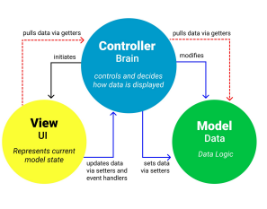
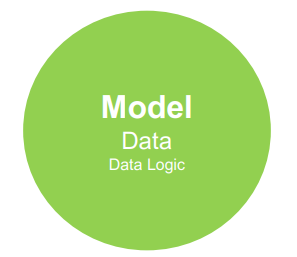
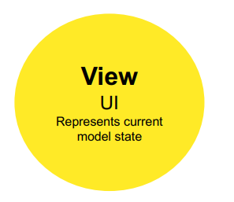
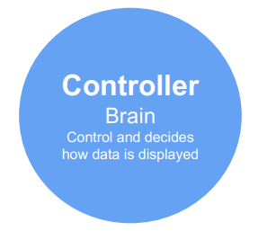
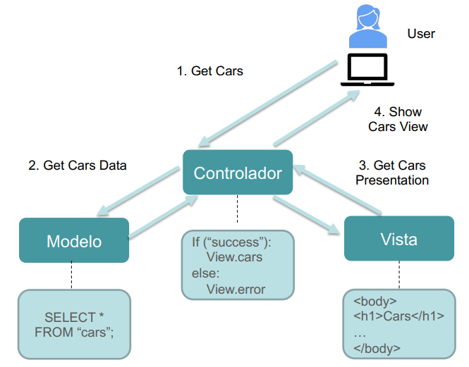

# Como estructurar el código

Una buena estructura en nuestra aplicación es fundamental para mejorar la mantenibilidad, reutilización y escalabilidad del código. En este sentido, el patrón **Modelo-Vista-Controlador (MVC)** nos ayuda a realizar esta tarea en el desarrollo de servidores web.

## MVC


El concepto de MVC fue originalmente inventado por programadores de **SmallTalk**, específicamente por **Trygve Reenskaug** (Oslo). Su definición fue finalmente publicada en diciembre de 1979.
MVC es una **arquitectura de software** utilizada para separar el código de la aplicación en diferentes capas, cada una encargada de una tarea concreta. Esto permite mejorar la estructura y organización del código. Presenta una serie de beneficios como:

- **Separación de responsabilidades:** facilita la división del código en diferentes capas y por tanto segmentar el desarrollo según distintos perfiles de programadores.
- **Reutilización del código:** permite aprovechar componentes en diferentes partes de la aplicación.
- **Mejor mantenimiento:** al estar bien estructurado, es más fácil corregir errores y realizar mejoras. Evita el "código espagueti".
- **Escalabilidad:** favorece el desarrollo de aplicaciones más grandes y complejas.

MVC se fundamenta en la separación del código en **tres capas principales**, delimitadas por sus funciones: Modelo, Vista y Controlador.

<div class="img-center">
    
</div>

### Modelo
El **modelo** gestiona los datos.

- Es **independiente** de la interfaz de usuario.
- Se encarga de realizar las operaciones **CRUD** (Crear, Leer, Actualizar, Eliminar) sobre los datos.
- Se comunica directamente con la **base de datos**.
- Normalmente, se utiliza algún **ORM** (Object-Relational Mapping) para la gestión eficiente de los datos.

<div class="img-center">
    
</div>


### Vista
La **vista** es la encargada de la presentación y la visualización de la información para el usuario.

- Contiene el código responsable de la **interfaz de usuario**.
- Renderiza los estados de la aplicación en formatos específicos, como **HTML**.
- No accede directamente a los datos; en su lugar, **interactúa con el modelo** para obtener la información necesaria.

<div class="img-center">
    
</div>

### Controlador
El **controlador** actúa como intermediario entre el modelo y la vista, gestionando la interacción del usuario y la lógica de la aplicación. Es el encargado de gestionar las rutas del servidor web y de ejecutar determinadas lógicas.

- Responde a las **acciones del usuario** dentro de la aplicación.
- Actúa como **puente** entre la vista y el modelo.
- Implementa mecanismos y validaciones necesarias para el funcionamiento correcto de la aplicación.
- Sirve de puente para conectarse con otros servidores y obtener información. O de puente con otros scripts de la aplicación.


<div class="img-center">
    
</div>

---

En esencia, **el patrón MVC viene a decirnos que carpetas debemos crear y que código debemos meter en cada una de ellas**. A continuación se muestra un ejemplo de como se implementaría el patrón MVC. Como se puede observar cada uno de los elementos ejecuta un código determinado.

<div class="img-center">
    
</div>

<br>

MVC y la arquitectura de tres capas comparten el principio de separación de responsabilidades, aunque con enfoques ligeramente diferentes. En una arquitectura de tres capas, se dividen las responsabilidades en capa de presentación, capa de lógica de negocio y capa de acceso a datos, donde cada una cumple una función específica para mejorar la escalabilidad y mantenibilidad del sistema. De manera similar, MVC separa la aplicación en Vista (View), encargada de la presentación, Modelo (Model), que maneja la lógica y los datos, y Controlador (Controller), que gestiona la interacción entre ambas. Mientras que MVC se centra en la organización dentro del software a nivel de patrón de diseño, la arquitectura de tres capas suele aplicarse a nivel estructural en aplicaciones distribuidas, es decir, donde se ejecuta cada capa (ordenador de cliente, servidor web y servidor de base de datos).

## Estructurar el código en Python

La aplicación que vamos a desarrollar tendrá la siguiente forma.

```plaintext
rocodromo/
│
├── app/                    # Carpeta principal de la aplicación
│   ├── models/             # Carpeta que contiene la estructura de los datos. MODELO de MVC
│   ├── blueprints/         # Carpeta que contiene las rutas de acceso y ciertas lógicas. CONTROLADOR de MVC
│   ├── public/             # Carpeta que contiene ficheros que pueden accederse directamente a través de una URL
│   ├── templates/          # Carpeta que contiene las vistas de la aplicación, es decir los ficheros HTML. VISTA de MVC
│   ├── app.py              # Inicializa la aplicación y las configuraciones
├── requirements.txt        # Lista de dependencias del proyecto
└── env/                    # Entorno virtual
```

En Python, se acostumbra a usar la palabra "blueprints" para referirse a los controladores. En otros desarrollos como los basados en Node.js se suele usar la palabra "controller" directamente. Y al igual ocurre con "templates" para referise a las vistas en Python. En Node.js suele usarse la palabra "views". No obstante, la elección de la nomenclatura es flexible y puede ajustarse según los criterios y convenciones de cada equipo de desarrollo.

En este tema abordaremos el código de las carpetas de blueprints y templates. Las carpetas de public y models se harán en temas posteriores, al igual que otras carpetas que iremos viendo sobre la marcha. A continuación veremos como gestionar los ficheros HTML usando Jinja2. 