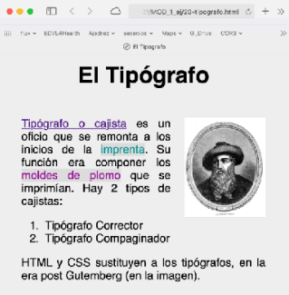
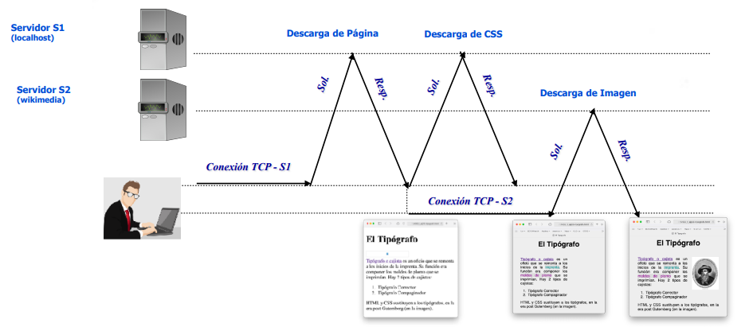
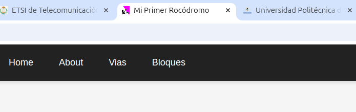

# Manejo de Ficheros

Como se ha comentado previamente, desde un servidor también podemos servir ficheros estáticos. Flask nos ofrece varias formas de servir ficheros estáticos y dependiendo del carácter del fichero (público o privado) se servirán de una forma u otra. 

Pero antes, conviene repasar, como se carga una página web. Ya que una **página web no se compone solo de código HTML**, si no también de otros ficheros como estilos CSS, imágenes, ficheros JS, etc. Estos ficheros se especifican mediante referencias y deben establecer varias conexiones para descargar todos los recursos que se necesitan. Además, **no todos los recursos pueden estar alojados en nuestro servidor, si no que pueden estar alojados en otros servidores**.

Por ejemplo, en la siguiente página web se descarga el fichero HTML, un fichero CSS y una imagen.

<div class="img-center">
    
</div>

<br>

Cuyo código es:

```html
<html>
<head>
    <title>El Tipografo</title>
    <meta charset="utf-8">
    <link rel="stylesheet" href="20-tipografo.css" type="text/css" />
</head>
<body>
    <h1>El Tipógrafo</h1>
    
    <div class="texto">
        <a href="https://es.wikipedia.org/wiki/Cajista">Tipógrafo o cajista</a> es un oficio que se remonta a los inicios de la... </a>
    </div>
</body>
</html>
```

Para ello sigue los siguientes pasos:

1. El cliente (navegador) establece inicialmente una conexión con el servidor S1 para cargar la página HTML.
2. Al analizar el contenido de la página HTML se identifican dos recursos adicionales que hay que descargar:
    1. Un estilo CSS alojado en el mismo servidor S1 (`20-tipografo.css`). Se descarga a través de la misma conexión inicial
    2. Una imagen del servidor S2 (wikimedia). Se descarga estableciendo una nueva conexión con el servidor S2.


<div class="img-center">
    
</div>

## Publicos

En la sección anterior desarrollamos una API Restful que nos permitá gestionar un servicio programable, es decir, unas rutas que nos permiten listar, visualizar, crear, actualizar y borrar ciertos recursos como las vías de un rocódromo. Esta información por lo general estará almacenada en una base de datos. Pero existe otra forma de almacena información y es mediante ficheros estáticos. En este caso, vamos a ver una de las formas de servir ficheros estáticos con Flask. 

La **carpeta public** contiene ficheros que será accesibles desde la URL de la aplicación. Pero en este caso, no tenemos porque definir una ruta en si, si no que debemos configurar a través de Flask cual es nuestra carpeta pública. Y **Flask ya se encargará de servir los ficheros estáticos que se encuentren en ella**.

Para ello, en el fichero app.py debemos configurar la carpeta pública de la siguiente forma:

```python
app = Flask(__name__, static_folder='public', static_url_path="",  template_folder='templates')
```

El parámetro **static_folder** en Flask se utiliza para definir la carpeta donde se encuentran los archivos estáticos. En este caso, la carpeta public.
El parámetro **static_url_path** en Flask se utiliza para definir la URL base desde la cual se sirven los archivos estáticos. En este caso desde raiz (/)

Y a través de esta carpeta podremos servir ficheros estáticos como estilos CSS, imágenes, logos, ficheros JS, etc.

### Favicon

El favicon es un icono que se muestra en la pestaña del navegador y en la barra de favoritos. Este icono es muy útil para identificar nuestra aplicación rapidamente dentro de un navegador. Basicamente, se trata de una imagen de 16x16 píxeles que se guarda en un fichero llamado `favicon.ico`.

Podemos buscar un icono en páginas como [https://www.flaticon.com/](https://www.flaticon.com/) pero se recomienda crearse uno propio. Para ello, podemos usar herramientas online como [https://www.favicon.cc/](https://www.favicon.cc/). Una vez tengamos nuestro icono, lo guardamos en la carpeta public con el nombre `favicon.ico`.

Recargar la página y veremos que en la pestaña del navegador aparece nuestro icono. A veces, es necesario limpiar la caché del navegador para que se muestre el icono. Se puede **ejectuar ctrl + F5 para limpiar la caché de nuestra página web** y veremos como se muestra el icono.

<div class="img-center">
    
</div>

<br>

### Estilos CSS

Para poder añadir estilos CSS a nuestra página web, debemos crear una **carpeta stylesheets** dentro de la carpeta public. Dentro de esta carpeta, podemos añadir los ficheros CSS que necesitemos. Por ejemplo, si queremos añadir un fichero llamado `styles.css` donde podriamos meter todos los estilos de nuestra página web. Pero, cuando la aplicación escale este fichero se puede hacer muy grande y dificil de mantener. Por lo que, **se recomienda dividir los estilos en varios ficheros y hacer un link a los estilos CSS en cada plantilla HTML**. 

Así por ejemplo, para los estilos del layout.html podríamos tener un fichero llamado `layout.css` y para los estilos de la página de home, un fichero llamado `home.css` y para el recurso de las vias, un fichero llamado `via.css`. Y luego en los ficheros HTML, añadimos al principio del fichero un link a los estilos CSS que necesitemos.:

**layout.html**
```html
<!DOCTYPE html> 
<html>
    <head>
        <title>Mi Primer Rocódromo</title>
        <link rel="stylesheet" href="/public/stylesheets/layout.css"></link>
    </head>
    <header>
...
```

**home.html**
```html


<link rel="stylesheet" href="/public/stylesheets/home.css"></link>
<div class="home">
    <h1>¡Bienvenido a mi primer rocódromo!</h1>
...
</div>

```

**via/show.html, via/new.html, via/edit.html y via/list.html**
```html


<link rel="stylesheet" href="/public/stylesheets/via.css"></link>
<div class="via">
...
</div>

```
Con esto, conseguimos que los estilos de cada página estén separados y sean más fáciles de mantener.

<blockquote>
<h4>Inciso: Separar estilos CSS</h4>
<p>
Si se fija, en el caso `home.css` y `via.css` hemos añadido una etiqueta <code>div</code> con una clase que coincide con el nombre del fichero CSS. Esto es una buena práctica para evitar que los estilos de un recurso afecten a los estilos de otro recurso. Por ejemplo, si en `home.css` añadimos un estilo para la etiqueta `h1` y en `via.css` añadimos otro estilo para la etiqueta `h1`, no habrá conflicto entre los estilos de ambas páginas. Para ello, luego en los ficheros CSS podremos añadir estilos así:
<br>
<br>
<b>home.css</b>
```css
.home h1 {
    color: red;
}
```

<b>via.css</b>
```css
.via h1 {
    color: red;
}
```
</blockquote>

<br>

### Imágenes, logos, audios, etc

Por otro lado, también podemos servir recursos multimedia a través de la carpeta public. Estos recursos permiten crear una página web más atractiva y dinámica. Por ejemplo, podemos añadir una imagen de fondo a nuestra página de inicio, una fuente de texto poco comun, un logo a nuestra página de vias, un video en loop, etc. 

Para ello, debemos crear una carpeta por cada tipo de recurso. Por ejemplo para imágenes, podemos crear una carpeta llamada **images** dentro de la carpeta public. Dentro de esa carpeta podemos almacenar las imágenes que necesitemos como por ejemplo el logo de nuestro servicio web. Y desde la página HTML, podemos añadir la imagen de la siguiente forma:

```html
<header>
    <nav>
        <a href="/">
            <!-- Especificamos la ruta a nuestro logo que esta en la carpeta public -->
            
        </a>
        <a href="/about">About</a>
        <a href="/vias">Vias</a>
        <a href="/bloques">Bloques</a>
    </nav>
</header>
```

Y así con el resto de imágenes, videos, audios... que consideremos que son de carácter público.

### Ficheros Javascript

Por último, también podemos añadir ficheros Javascript a nuestra aplicación. Estos ficheros nos permiten añadir interactividad a nuestra página web. Los ficheros de javascript se descargan y ejecutan en una página web dentro de los navegadores. Estos ficheros tienen una terminación `.js` y se pueden añadir a través de la carpeta public como hemos hecho previamente. Para ello, creamos un carpeta que se llame **javascripts**.

Por ejemplo, podemos añadir un fichero JS llamado **manage_vias.js** que tenga varias funcionalidades como mostrar un mensaje de confirmación cuando el usuario quiera borrar una vía. 

```Javascript
document.addEventListener('DOMContentLoaded', function() {
    const forms = document.getElementsByClassName('deleteVia');
    if (forms.length > 0) {
        Array.from(forms).forEach(function(form) {
            form.addEventListener('submit', function(event) {
                if (!confirm("¿Estás seguro de que deseas eliminar esta vía?")) {
                    event.preventDefault();
                }
            });
        });
    }
});
```

Y luego en nuestro fichero via/list.html podemos añadir nuestro fichero javascript de la siguiente forma:

```html


<link rel="stylesheet" href="/stylesheets/via.css"></link>
<script src="/javascripts/manage_vias.js" ></script> 

...

```

En futuras secciones se profundizará en Javascript de Cliente. En este caso, basta con entender como podemos añadir lógica a nuestras páginas web a través de ficheros JS descargados desde el servidor que estamos desarrollando.

---

Con todo esto, la estructura de las carpetas de nuestra aplicación quedaría de la siguiente forma:

```plaintext
rocodromo/
│
├── app/                    # Carpeta principal de la aplicación
│   ├── models/             # Contiene la estructura de los datos. MODELO de MVC
│   ├── blueprints/         # Contiene las rutas de acceso y ciertas lógicas. CONTROLADOR de MVC
│       ├── via.py          # Controlador de las rutas de vias
│       ├── bloque.py       # Controlador de las rutas de bloques
│       ├── __init__.py     # Para importar blueprints
│   ├── public/             # Contiene ficheros que pueden accederse directamente a través de una URL
│       ├── stylesheets     # Contiene los estilos CSS divididos por páginas
│       ├── javascripts     # Contiene los ficheros javascript divididos por páginas
│       ├── images          # Contiene imágenes y logos
│       ├── favicon.ico     # Favicon de la aplicación
│   ├── templates/          # Contiene las vistas de la aplicación, es decir los ficheros HTML. VISTA de MVC
│       ├── via/            # Contiene las vistas para las vias
│       ├── bloque/         # Contiene las vistas para las bloques
│       ├── layout.html     # Contiene el layout base de la aplicación
│   ├── app.py              # Inicializa la aplicación y las configuraciones
├── requirements.txt        # Lista de dependencias del proyecto
└── env/                    # Entorno virtual
```

## Privados


Con todo esto, la estructura de las carpetas de nuestra aplicación quedaría de la siguiente forma:

```plaintext
rocodromo/
│
├── app/                    # Carpeta principal de la aplicación
│   ├── assets/             # Contiene ficheros estáticos que no pueden accederse directamente a través de una URL
│   ├── models/             # Contiene la estructura de los datos. MODELO de MVC
│   ├── blueprints/         # Contiene las rutas de acceso y ciertas lógicas. CONTROLADOR de MVC
│       ├── via.py          # Controlador de las rutas de vias
│       ├── bloque.py       # Controlador de las rutas de bloques
│       ├── __init__.py     # Para importar blueprints
│   ├── public/             # Contiene ficheros que pueden accederse directamente a través de una URL
│       ├── stylesheets     # Contiene los estilos CSS divididos por páginas
│       ├── javascripts     # Contiene los ficheros javascript divididos por páginas
│       ├── images          # Contiene imágenes y logos
│       ├── favicon.ico     # Favicon de la aplicación
│   ├── templates/          # Contiene las vistas de la aplicación, es decir los ficheros HTML. VISTA de MVC
│       ├── via/            # Contiene las vistas para las vias
│       ├── bloque/         # Contiene las vistas para las bloques
│       ├── layout.html     # Contiene el layout base de la aplicación
│   ├── app.py              # Inicializa la aplicación y las configuraciones
├── requirements.txt        # Lista de dependencias del proyecto
└── env/                    # Entorno virtual
```