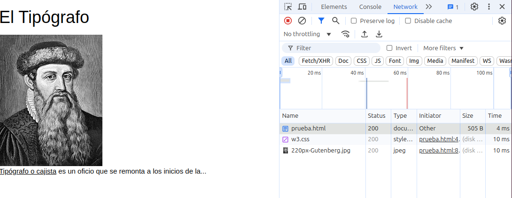

# Manejo de Ficheros

En el tema anterior desarrollamos una API Restful que nos permitía gestionar un servicio programable, es decir, unas rutas que nos permiten listar, visualizar, crear, actualizar y borrar ciertos recursos como las vías de un rocódromo. Esta información por lo general estará almacenada en una base de datos. Pero existe otra forma de almacena información y es mediante ficheros estáticos. Flask nos ofrece varias formas de servir ficheros estáticos que dependen del carácter del fichero: público o privado. 

Pero antes, conviene repasar, como se carga una página web. Ya que una **página web no se compone solo de código HTML**, si no también de otros ficheros como estilos CSS, imágenes, ficheros JS, etc. Estos ficheros se especifican mediante referencias y deben establecer varias conexiones para descargar todos los recursos que se necesitan. Además, **no todos los recursos pueden estar alojados en nuestro servidor, si no que pueden estar alojados en otros servidores**.

Por ejemplo, en la siguiente página web se descarga el fichero HTML, un fichero CSS y una imagen.

<div class="img-center">
    
</div>

<br>

Cuyo código es:

```html
<html>
<head>
    <title>El Tipografo</title>
    <meta charset="utf-8">
    <link rel="stylesheet" href="https://www.w3schools.com/w3css/4/w3.css" type="text/css" />
</head>
<body>
    <h1>El Tipógrafo</h1>
    
    <div class="texto">
        <a href="https://es.wikipedia.org/wiki/Cajista">Tipógrafo o cajista</a> es un oficio que se remonta a los inicios de la... </a>
    </div>
</body>
</html>
```

La página web se descarga el contenido de la siguiente forma:

1. El cliente (navegador) establece inicialmente una conexión con el servidor S1 para cargar la página HTML.
2. Al analizar el contenido de la página HTML se identifican dos recursos adicionales que hay que descargar:
    1. Un estilo CSS alojado en el mismo servidor S1 (`20-tipografo.css`). Se descarga a través de la misma conexión inicial
    2. Una imagen del servidor S2 (wikimedia). Se descarga estableciendo una nueva conexión con el servidor S2.


<div class="img-center">
    
</div>

<br>

De hecho, si abrimos las developer tools de nuestro navegador y vamos a la pestaña de Network, podremos ver como se descargan los ficheros de la página web.

<div class="img-center">
    
</div>

---

Se ha descrito la forma en que una página web se descarga ficheros según se renderizan. Pero, **¿cómo se sirven estos ficheros desde un servidor?**. Flask nos ofrece varias formas de servir ficheros estáticos y dependiendo del carácter del fichero (público o privado) se servirán de una forma u otra.