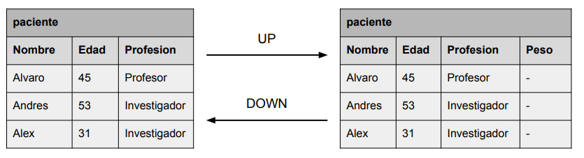

# Modelos y migraciones

Integrar una base de datos en nuestro servidor web nos permite estructurar la información y acceder a la misma, la cual se almacena de forma persistente. En este contexto entran en juego dos conceptos clave de los ORM: modelos y migraciones.

A través de ese modelo definimos las tablas que vamos a tener en la base de datos y las relaciones entre ellas. Para ello, a través de **SQL Alchemy definimos un objeto dentro de nuestro código que luego, el propio ORM se encargará de transformarlo en una tabla dentro de la base de datos a través de una migración**. 

Posteriormente, si deseamos añadir o modificar alguna tabla, podremos hacerlo a través de migraciones. Las migraciones son importantes porque nos permiten **actualizar la estructura de la base de datos sin perder los datos que ya tenemos almacenados**. Lo cual es de vital importancia en aplicaciones en producción. Y además nos permiten tener un control sobre la versión de la base de datos, de tal forma que podamos volver a una versión anterior si fuera necesario.

<div class="img-center">
    
</div>

## Modelos con SQL Alchemy

Como se ha comentado previamente, los modelos en SQL Alchemy son clases que representan tablas en la base de datos. Estas clases se crearán en la carpeta `models` que ya habiamos creado previamente. Por ejemplo, podemos crear un fichero `via.py` con el siguiente contenido:

```python
from app import db # Importamos el objeto db de la base de datos inicializado en app

class Via(db.Model):
    __tablename__ = 'via'

    id = db.Column(db.Integer, primary_key=True, autoincrement=True)
    nombre = db.Column(db.String(255), nullable=False)
    grado = db.Column(db.String(255), nullable=False)
    altura = db.Column(db.Integer, nullable=False)
    desplome = db.Column(db.Boolean, default=False)
    filename = db.Column(db.String(120), nullable=True, unique=True)
```

Recuerde que los modelos permiten definir el carácter de los atributos (primary_key, unique, default, etc) y añadir métodos que permiten realizar operaciones sobre los datos. Y que también se pueden establecer relaciones 1:1, 1:N y N:M entre modelos distintos como se pedirá más adelante en la asignatura.

No obstante, el como se edita un modelo esta fuera del alcance de esta asignatura, pero se puede consultar las transparencias de la asignatura Bases de Datos Relacionales o la [documentación oficial de SQL Alchemy](https://docs.sqlalchemy.org/en/20/orm/tutorial.html) para más información.

Al igual que hicimos con los blueprints, generaremos un fichero `__init__.py` en la carpeta `models` para que Python reconozca la carpeta como un paquete y podamos importar todos nuestros modelos de forma sencilla. En este fichero colocaremos el siguiente contenido:

```python
from .via import Via
```

En este momento, aunque arranquemos la aplicación, no se creará la tabla en la base de datos. Para ello, debemos generar una migración con Alembic.

## Migraciones con Alembic

**Alembic** es una herramienta de migraciones de bases de datos para SQLAlchemy. Permite gestionar cambios en el esquema de la base de datos de forma estructurada y versionada. Entre otras cosas permite:

- Creación y aplicación de migraciones de esquema.
- Soporte para migraciones automáticas basadas en cambios en los modelos SQLAlchemy.
- Gestión de versiones de la base de datos.
- Posibilidad de revertir y actualizar migraciones fácilmente.

**Flask-Migrate** es una extensión de Flask que integra Alembic con Flask y SQLAlchemy. Facilita la gestión de migraciones en aplicaciones Flask sin necesidad de manejar Alembic manualmente. Nos da una serie de comandos CLI para gestionar las migraciones de forma sencilla como `flask db init`, `flask db migrate`, `flask db upgrade`, etc.


Para poder realizar migraciones lo primero es incluir en `app.py` las siguientes líneas de código:

```python
# Import models to be migrated
from models import Via

migrate = Migrate(app, db)
```

La primera línea permite importar los modelos que queremos migrar. La segunda línea inicializa Flask-migrate con nuestra aplicación y la base de datos. No obstante, esto no es un proceso automático, por lo que debemos realizar los siguientes pasos:

<span>1.</span> **Inicializar y crear el directorio de migraciones**. Para ello, en la terminal y dentro de nuestro proyecto debemos ejecutar:
    
```bash
flask db init --directory app/models/migrations
```

Este comando va a generar una estructura de directorios y ficheros bajo la carpeta `migrations`. En concreto genera:

- `alembic.ini`: Configuración de Alembic.
- `env.py`: Configuración de la migración de Alembic que define como se ejecutan las migraciones.
- `script.py.mako`: Plantilla para los scripts de migración.
- `versions/`: Contiene los archivos de migración generados.


<span>2.</span> **Generar una nueva migración**. Esto va a permitir generar un fichero que contiene los cambios detectados en los modelos. Es importante comentar que solo se genera pero los cambios no se ejecutan. Para generar una migración debemos ejecutar:

```bash
flask db migrate -m "Initial migration" --directory app/models/migrations
```

Este comando va a generar un fichero en la carpeta `versions` con el nombre `XXXX_initial_migration.py` donde `XXXX` es un número que identifica la versión de la migración. En este fichero se encuentran las instrucciones necesarias para aplicar los cambios en la base de datos que se ejecutaran posteriormente. En concreto tiene dos funciones:

- `upgrade()`: Define los cambios que se deben aplicar a la base de datos.
- `downgrade()`: Define los cambios que se deben realizar para revertir el estado de la base de datos.

<span>3.</span> **Ejecutar migración**:

```bash
flask db upgrade --directory app/models/migrations 
```

Este comando va a aplicar los cambios en la base de datos. Si en algún momento queremos revertir los cambios, podemos hacerlo con el comando:

```bash
flask db downgrade --directory app/models/migrations
```

La primera vez que se ejecuta el comando `flask db upgrade` se creará la tabla `alembic_version` en la base de datos. En esta tabla se quedará almacenada la versión de la última migración que se ejecute. De esta forma, Alembic puede saber si una migración ya ha sido aplicada o no y nos permite aplicar el control de versiones que se ha comentado previamente. 

---

Flask-Migrate ofrece también otros comandos para manejar migraciones. El comando `flask db stamp` permite aplicar una migración especifica. Si por ejemplo, queremos aplicar la migración `XXXX_initial_migration.py` podemos hacerlo con el comando:

```bash
flask db stamp XXXX --directory app/models/migrations
```

Además, podemos observar el historial de migraciones que se han aplicado:

```bash
flask db history --directory app/models/migrations
```

### Orden para meter nuevos cambios

Para poder integrar ahora nuevos cambios en la base de datos, debemos seguir un proceso similar al anterior:

<span>1.</span> **Crear o editar un modelo**. Si deseamos crear un modelo, basta con generar un nuevo fichero en la carpeta `models` y definir la clase que representará la tabla en la base de datos. Este modelo se debe incluir en el fichero `__init__.py` de la carpeta `models` y se debe importar en app.py para que se cree posteriormente. 

Si deseamos editar un modelo, como por ejemplo, añdiendo un nuevo atributo a la tabla via.py, editamos el fichero correspondiente via.py directamente:

```python
from database import db # Importamos el objeto db de la base de datos

class Via(db.Model):
    __tablename__ = 'via'

    id = db.Column(db.Integer, primary_key=True, autoincrement=True)
    nombre = db.Column(db.String(255), nullable=False)
    grado = db.Column(db.String(255), nullable=False)
    altura = db.Column(db.Integer, nullable=False)
    desplome = db.Column(db.Boolean, default=False)
    filename = db.Column(db.String(120), nullable=True, unique=True)
    numero_chapas = db.Column(db.Integer, nullable=False) # Nuevo atributo
```

También se podría editar un modelo para cambiar el tipo de una columna, añadir una relación, definir una columna como única, eliminar una columna, etc.


<span>2.</span> **Generar una nueva migración**. En este caso, pasamos directamente a generar una nueva migración, ya que el flask init ya lo hicimos previamente. Para ello, ejecutamos:

```bash
flask db migrate -m "New attribute numero_chapas in vías" --directory app/models/migrations
```

Es importante añadir un mensaje descriptivo en el parámetro `-m` para que, en el futuro, se pueda identificar el cambio en la migración.

<span>3.</span> **Ejecutar migración** como hemos visto anteriormente

---

Con todo esto, la estrucutra de ficheros nos queda de la siguiente manera:

```plaintext
rocodromo/
│
├── app/                    # Carpeta principal de la aplicación
│   ├── assets/             # Contiene ficheros estáticos que no pueden accederse directamente a través de una URL
│       └── images          # Contiene imágenes de carácter privado
│   ├── models/             # Contiene la estructura de los datos. MODELO de MVC
│       ├── via.py          # Modelo de las vias
│       ├── __init__.py     # Para importar modelos
│       └── migrations      # Contiene las migraciones de la base de datos
│           ├── env.py          # Configuración de la migración de Alembic que define como se ejecutan las migraciones
│           ├── script.py.mako  # Plantilla para los scripts de migración
│           ├── alembic.ini     # Configuración de Alembic
│           └── versions/       # Contiene los archivos de migración generados
│   ├── blueprints/         # Contiene las rutas de acceso y ciertas lógicas. CONTROLADOR de MVC
│       ├── via.py          # Controlador de las rutas de vias
│       ├── bloque.py       # Controlador de las rutas de bloques
│       └── __init__.py     # Para importar blueprints
│   ├── public/             # Contiene ficheros que pueden accederse directamente a través de una URL
│       ├── stylesheets     # Contiene los estilos CSS divididos por páginas
│       ├── javascripts     # Contiene los ficheros javascript divididos por páginas
│       ├── images          # Contiene imágenes y logos
│       └── favicon.ico     # Favicon de la aplicación
│   ├── templates/          # Contiene las vistas de la aplicación, es decir los ficheros HTML. VISTA de MVC
│       ├── via/            # Contiene las vistas para las vias
│       ├── bloque/         # Contiene las vistas para las bloques
│       └── layout.html     # Contiene el layout base de la aplicación
│   ├── app.py              # Inicializa la aplicación y las configuraciones
│   ├── database.py         # Contiene el objeto de conexión a la base de datos
│   ├── handle_files.py     # Middlewares para gestionar ficheros
├── requirements.txt        # Lista de dependencias del proyecto
└── env/                    # Entorno virtual
```
<br>

#### Ejercicio de Clase

Tenemos nuestra aplicación en producción donde una de las tablas tiene una columna de tipo String. En dicha columna se almacenan principalmente números pero a veces se almacenan letras. ¿Que ocurre si realizamos una migración en la que modificamos una columna de tipo String que pase a ser Integer? 

---

Por lo general, cuando se ejecuta descarga y se ejecuta un proyecto por primera vez, se suelen insertar datos por defecto en la base de datos. En la siguiente sección veremos como podemos hacerlo.