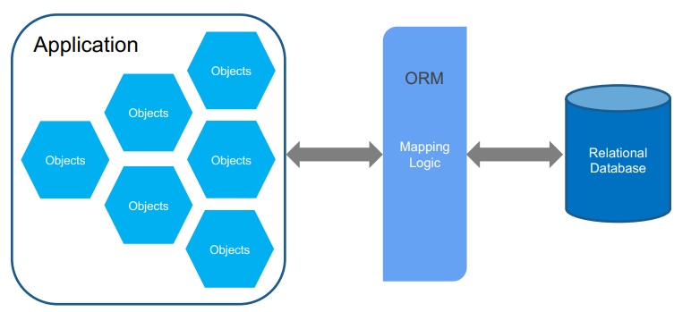

# Modelado de datos

Hasta ahora hemos trabajado con datos que se almacenaban en un array de objetos, de tal forma que esa información se perdía cada vez que se reiniciaba la aplicación. Esto es útil para entender cómo funcionan las rutas, los controladores y las vistas, pero en la práctica los datos se almacenan en bases de datos SQL o noSQL lo que permite la existencia de la información a lo largo del tiempo, independientemente del estado de la aplicación. En esta asignatura, **se usará una base de datos de tipo SQL**. 

Uno de los aspectos más determinantes en el desarrollo de una aplicación web es el **modelado de datos**, a través del cual se define toda la estructura fundamental sobre la que se construye todo el sistema. El modelo de datos marca la lógica de rutas que debemos seguir para acceder a la información e influye en el diseño final de la aplicación.

El modelado de datos, principalmente, define cómo se estructuran y relacionan los datos dentro de una base de datos. **Un modelo mal diseñado puede derivar en consultas lentas, inconsistencias en los datos y problemas al escalar la aplicación**. Por ello, es importante tener en cuenta buenas prácticas de diseño de bases de datos relacionales, como la normalización de tablas, la definición de claves primarias y foráneas, y la creación de índices.

Por otro lado, el desarrollo de un modelo de datos no solo implica la creación de tablas y relaciones, sino también la **definición de las operaciones que se pueden realizar sobre los datos, lo cual afecta directamente a la definición del modelo**. También es necesario tener en cuenta otros aspectos como la seguridad o las migraciones de bases de datos, que son cambios controlados de la estructura de la base de datos como veremos más adelante. Estas **migraciones se realizan a la par que se crea o edita el modelo de datos** a lo largo del tiempo y son las que nos permiten tener un control sobre la versión de la base de datos. 

Los ORM (Object Relational Mapping) permiten abordar todas estas cuestiones ya que suelen incluir herramientas para el modelado de datos, la definición de operaciones y la gestión de migraciones. En Flask, usaremos un ORM llamado **SQLAlchemy** para aprovechar estas ventajas. Por otro lado, las migraciones las abordaremos con **Alembic**. 

## Object Relational Mapping (ORM)

Un ORM es una técnica de programación que consiste en **mapear las tablas de una base de datos a clases de un lenguaje de programación**. 

<div class="img-center">
    
</div>

<br>

Un ORM tiene una serie de ventajas:

- Permite abstraernos de escribir código SQL.  
- Permite sacar partido a las bondades de la programación orientada a objetos.  
- Permite aumentar la reutilización del código y mejorar el mantenimiento del mismo.  
- Mayor seguridad, higienizando los datos que llegan, evitando posibles ataques de inyección SQL y similares.  
- Proveen múltiples herramientas para el acceso a los datos, conversión de tipos, internacionalización del modelo de datos, entre otros.  

Otra de las ventajas que tienen los **ORMs es que pueden operar con diferentes bases de datos**, ya que la mayoría de ellos soportan varios motores de bases de datos. Generalmente, cuando se instala un ORM se debe instalar también el driver que se usará para la base de datos con la que se va a trabajar

## SQLAlchemy

SQLAlchemy es un ORM para Python. SQLAlchemy soporta SQLite, PostgreSQL, MySQL, Oracle, entre otros. En su [página web](https://docs.sqlalchemy.org/en/20) se ecuentra toda la documentación necesaria para su uso.

Para el proyecto de ejemplo usaremos la base de datos **Mysql**.

Para poder integrar una base de datos en nuestro proyecto tendremos que instalar: 

- **flask_sqlalchemy**: Extensión de Flask que integra SQLAlchemy, permitiendo el uso de un ORM para manejar bases de datos de forma más sencilla.  
- **mysql-connector-python**: Conector oficial de MySQL para Python, que permite la comunicación directa con bases de datos MySQL.  
- **sqlalchemy_utils**: Conjunto de utilidades para SQLAlchemy, incluyendo creación/eliminación de bases de datos, validaciones y tipos de datos adicionales.  
- **flask_migrate**: Extensión que integra Alembic con Flask-SQLAlchemy para gestionar migraciones y cambios en la estructura de la base de datos.  

```bash
pip install Flask-SQLAlchemy Flask-Migrate mysql-connector-python sqlalchemy_utils 
```

Una vez instalados las librerías, **debemos actualizar la lista** `requirements.txt`:

```bash
pip3 freeze > requirements.txt 
```

Una vez instaladas las dependencias, vamos a crear un fichero llamado `database.py` en el que vamos a crear el objeto de conexión a la base de datos a través de SQL Alchemy. Esto nos evitará en el futuro problemas de importación circular.  

```python
from flask_sqlalchemy import SQLAlchemy
db = SQLAlchemy()
```

En el fichero `app.py` vamos a importar el objeto `db` y vamos a inicializarlo con nuestra aplicación Flask de la siguiente manera:

```python
from sqlalchemy_utils import create_database, database_exists
from flask_sqlalchemy import SQLAlchemy
from flask_migrate import Migrate
from database import db

...

##### Configure Database
from flask_sqlalchemy import SQLAlchemy
db = SQLAlchemy()
app.config['SQLALCHEMY_DATABASE_URI'] = 'mysql+mysqlconnector://<user>:<password>@localhost/<database>'
app.config['SQLALCHEMY_TRACK_MODIFICATIONS'] = False
db.init_app(app)

##### Create the database if it doesn't exist
if not database_exists(app.config['SQLALCHEMY_DATABASE_URI']):
    create_database(app.config['SQLALCHEMY_DATABASE_URI'])
```

Con el código anterior hemos:

<ul>
    <li class="nested_list">Configurado la base de datos en nuestra aplicación Flask. Para ello, hemos definido la URL que incluye:
        <ul>
            <li class="nested_list">El <b>tipo de base de datos</b> (mysql).</li>
            <li class="nested_list">El <b>usuario y contraseña</b> de la base de datos.</li>
            <li class="nested_list">La <b>dirección</b> de la base de datos (localhost). El puerto no hace falta configurarlo porque SQL Alchemy ya lo tiene por defecto configurado para Mysql (3306).</li>
            <li>El <b>nombre de la base de datos</b>.</li>
        </ul>
    </li>
    <li>Inicializado el objeto <code>db</code> con nuestra aplicación Flask.</li>
    <li>Comprobado si la base de datos existe, y si no existe la hemos creado usando las librerías <code>create_database</code> y <code>database_exists</code> de <code>sqlalchemy_utils</code>.</li>
</ul>

Con esto, hemos establecido una conexión contra una base de datos MySQL y estaremos listos para trabajar con ella.


